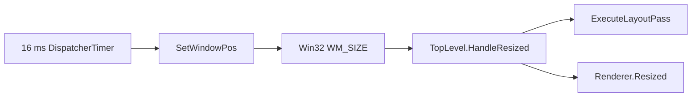

# 性能与架构审查报告

> 修复进度：F01–F04 的动画清理、辉光参数更新、背景/边框/对齐和间距问题已实现修复；F09 的每次布局诊断已改为按需更新。Demo 顶部增加“修复检查”，并提供滚动入口。视觉效果待用户验收；F05–F08 的性能测量与架构决策仍待后续处理。
>
> 以下为修复前的审查快照：2026-10-05，HEAD `4b8da38ae3443e7e9f73a6cacc6fd1b1d03a6695` 加当时工作区。保留原始证据与建议作为历史参考，不是现行设计规范，也不代表视觉验收。审查阶段未修改产品代码、公开 API、依赖与现有设计决策。

## 结论

当前架构方向合理：主题资源、窗口行为、全屏控制器、按钮材质适配的职责基本清楚，使用 Avalonia 原生属性、模板、Transition 和窗口契约，代码规模与抽象层数适合当前控件数量。没有证据支持全面重写、增加通用服务层或更换整个动画系统。

当前实现仍存在可复现的动画生命周期和上游属性契约缺口；真实窗口动画存在固定定时器、同步 Resize 与正文重排成本；完整替换装饰模板还没有公开接入契约。因此，现阶段不能认定已经满足“高效且易扩展、没有降级或非常规处理”的全部要求。

本次确认 **5 类行为缺陷**：前景过渡残留、接近距离修改后状态不更新、渐变背景丢失、装饰层普通边框丢失、内容对齐属性无效。另外确认了 Margin 被内外两层消费的几何关系。性能方面确认了成本路径，尚未测得实际帧率、GPU 时间或真实桌面分配量。

建议先修复这些局部契约和生命周期问题，再建立真实场景性能基线并改进动画调度，之后明确完整模板替换与平台兼容边界。涉及交互行为、公开 API、依赖或大范围架构的建议，需要后续按仓库约定讨论后实施。

## 范围与证据等级

审查覆盖库的全部生产 C#、AXAML、资源入口，Demo，库/Demo 测试，Win32 冒烟程序和构建配置。当前能力主要是 `VhilzWindow`、`TitleBar`、窗口装饰按钮及资源主题；默认控件的全面覆盖仍是建设目标。

依据包括用户本次要求、[AGENTS.md](../AGENTS.md)、[资源字典设计](resource-dictionary-design.md)、[资源键命名](resource-key-naming.md) 和 [优化任务清单](optimization-tasks.md)。另核对了本机实际安装的 Avalonia 12.1.3 程序集和 XML 文档。现有未提交的 `window-material-pipeline-research.md` 是候选路线调研，未当作已实现能力，本次未改动它。

| 标记 | 含义 |
| --- | --- |
| 已复现 | 临时探针实际驱动相关代码，得到明确失败或布局计数；不等于屏幕视觉验收 |
| 源码确认 | 可从控制流、模板和当前上游实现确认成本或限制，尚无真实桌面性能测量 |
| 待实机 | 有具体触发条件和推导路径，但尚未观察到对应平台结果 |
| 决策项 | 是否支持、如何支持需要明确产品契约，不能直接当作默认模板的运行缺陷 |

下文 P2 表示应在扩大控件覆盖和正式承诺相关契约前处理；P3 表示测量或维护机会。本次没有发现已证实的 P0/P1 崩溃、严重泄漏或数据损坏问题。

## 架构与人类可读性评估

| 模块 | 当前职责与评价 | 需要改善的局部 |
| --- | --- | --- |
| `VhilzTheme` / 资源字典 | 主题入口直接，明暗和稳定参数分开；资源键集中管理 | 持续以实际消费者维护语义资源，不把候选值固化为全局规范 |
| `VhilzWindow` | 公开属性、上游窗口生命周期、模板部件及标题避让；职责总体合理 | 明确应用替换装饰模板时能使用的契约 |
| `DecorationRegistration` | 自有模板主动登记，避免生产窗口全树搜索 | 登记属于内部实现，外部模板没有同等入口 |
| `FullscreenTitleBarController` | 顶边输入、展开/收回和正文避让集中 | 上游父容器可见性与事件顺序假设需集中管理；正文重排需测量 |
| `WindowsFullscreenTransition` | Win32 原生窗口几何插值，平台状态与恢复矩形交给 Avalonia | 固定定时器、嵌套消息和 DPI 取消边界需要核对 |
| `CaptionSurface` 两个 partial 文件 | 材质/指针与状态动画分开，属性名可读 | 渲染契约、参数变化和父控件属性所有权不完整 |
| `CaptionGeometryIcon` | 小型 Lucide 路径适配，直接绘制、复用 Pen | 升级 Lucide 时继续核对绘制契约 |
| Demo / 测试 | 展示和测试项目分离，有确定性动画时钟 | Demo 诊断进入每次布局路径，性能与验收场景仍不充分 |

Avalonia 的属性注册与 CLR 包装虽重复，但属于框架惯例，便于读者搜索属性与追踪绑定。当前按窗口功能放置实现、只用两个明确职责的 partial 文件，也没有明显的抽象过度问题。文件长度本身不是拆分依据。

最需要改善的可读性是隐藏的所有权和时序：哪个模板拥有父按钮的 `Transitions`、哪些属性变化使指针缓存失效、哪些消息交还平台、外部模板如何接入。把这些事实写进方法名、对称清理和可执行测试，比引入更多接口层更有价值。

## 行为与接口发现

### F01 / P2：模板注入的前景过渡未随角色退出或卸载撤销

**状态：已复现。** 位置：[CaptionSurface.Motion.cs](../Vhilz.Avalonia/Controls/Windows/CaptionSurface.Motion.cs) 第 100–105、117–118 行；[CaptionSurface.cs](../Vhilz.Avalonia/Controls/Windows/CaptionSurface.cs) 第 36–45 行。

关闭按钮表面通过模板优先级向父按钮写入一个 `BrushTransition`，但丢弃了写入返回的撤销句柄。移除 `VhilzCaptionClose` 后只重新执行添加逻辑，没有移除旧值；旧表面卸载时也不归还它。

探针确认两个触发场景：

- 移除关闭类，`surface.IsClose` 已为 `false`，父按钮仍有一个前景过渡。
- 更换为空主题，确认旧表面已经卸载，父按钮仍有同一个模板注入的过渡。

影响是旧模板继续改变新角色/新模板的前景动画，参数维护者却已经退出。这是行为残留和属性所有权问题；本次没有证实旧表面发生内存泄漏。

**更改方向：** 保存模板优先级写入的 `IDisposable`，在关闭角色退出、模板父改变、重新挂载和卸载时对称释放。保持应用本地 `Transitions` 的优先级，释放自己持有的值，而不是无条件清空应用配置。补充角色切换、模板替换及应用覆盖的回归。

### F02 / P2：动态接近距离修改后，当前揭示强度保持旧值

**状态：已复现。** 位置：[CaptionSurface.cs](../Vhilz.Avalonia/Controls/Windows/CaptionSurface.cs) 第 81–96 行。

装饰层强度只在 `PointerMoved` 中计算。指针停在距按钮 7.5 DIP 的位置，距离参数为 15 时强度是 `0.5`；将 `RevealProximityDistance` 改为 30 后仍是 `0.5`，正确值应为 `0.75`。更新要等下一次指针移动。

这破坏运行时参数覆盖的即时性。控件移动、尺寸变化后使用旧局部坐标，也有类似缓存失效风险，但该场景尚未单独复现。

**更改方向：** 将强度计算提取为无副作用的小函数，指针和距离属性变化共用；布局变化时从保存的根坐标重新转换，避免把旧局部坐标用于新几何。仅在可见像素确实变化时请求重绘，保留目前无辉光时免重绘的优化。

### F03 / P2：窗口按钮主题未完整保留上游 Background、Border 和内容对齐契约

**状态：三个子项均已复现。** 主题公开面是标准 `Button` 及其 `IBrush`、边框和内容对齐属性，当前没有文档声明这些属性受限。

| 子项 | 实际结果与位置 | 更改方向 |
| --- | --- | --- |
| 渐变背景 | `LinearGradientBrush` 传入后，绘制指令使用透明 `SolidColorBrush`；`CaptionSurface.Motion.cs:119–120` 与 `WindowDecorations.axaml:119–123` 只提取 `ISolidColorBrush.Color` | 普通背景绘制与实色状态动画分别负责；非实色画笔有真实绘制路径，实色仍可使用 ColorTransition |
| 普通边框 | 设置红色 BorderBrush 和 2 DIP BorderThickness 后，装饰分支的绘制指令没有 Pen；`WindowDecorations.axaml:94–95` 虽绑定属性，`CaptionSurface.cs:54–78` 未消费 | 用共享 Border 层或按 Border 的圆角/四边厚度语义绘制，保证正文预览与实际装饰一致 |
| 内容对齐 | 46×32 的按钮放入 10×10 内容，设置 Left/Top 后仍在 `(18,11)`，即正中；`WindowDecorations.axaml:124–126` 写死 Center | 默认居中通过主题 Setter 表达，模板绑定上游内容对齐属性 |

渐变和边框探针直接记录装饰分支的 DrawingContext 指令；内容对齐探针使用生产主题的真实布局。这些证据证明属性契约缺口，不证明材质像素或屏幕观感。

非实色画笔支持不能通过“统一转透明”静默处理。若产品确实希望限制这些标准属性，应先讨论 API/行为影响并明确文档，而不是继续让合法属性值失效。

### F04 / P2：Button.Margin 同时承担外部间距与内部表面收缩

**状态：布局关系已复现，归属问题属于架构判断。** 位置：[WindowDecorations.axaml](../Vhilz.Avalonia/Themes/Controls/WindowDecorations.axaml) 第 49、98、132 行。

Button 的外部布局已经消费 Margin；模板又把同一 Margin 传给内部材质表面和焦点轮廓。探针中外部 Button 为 46×32、Margin 为 4，内部表面实际变成 38×24，位置为 `(4,4)`。

因此应用增加按钮外间距时，还会缩小内部高亮、图标可用区和焦点轮廓。一个属性承担两个不同的布局含义，使用者难以预测覆盖结果。

**更改方向：** 外部间距保留在 Button 层。如果内部确有独立留白需求，用含义明确的模板参数表达；默认形状变化应同步维护明暗 Demo 并进行视觉验收。不能简单删掉绑定后宣称默认外观等价。

## 动画、性能与兼容发现

### F05 / P2：固定 16 ms 定时器没有与 Avalonia 动画节拍协同

**状态：调度与 Resize 成本由源码确认，实际帧率待测。** 位置：[WindowsFullscreenTransition.cs](../Vhilz.Avalonia/Controls/Windows/WindowsFullscreenTransition.cs) 第 43、149–160、170–184 行。

该路径使用 `DispatcherTimer(DispatcherPriority.Render)`，每帧调用 `SetWindowPos`。核对实际 Avalonia 12.1.3 的 `DispatcherTimer.FireTick()`：Tick 返回后才 Restart，下一期限是当前时刻加 Interval。实际间隔因此包含回调/同步布局成本和队列延迟；Render 优先级并不使它成为显示刷新时钟。

上游路径为：



核对的 `TopLevel.HandleResized` 会更新 ClientSize/Width/Height，执行布局并通知 Renderer。复杂正文会进入原生动画回调的成本路径；高刷新率屏幕也无法自然按其刷新节奏更新。

**更改方向：** 优先评估已存在的公开 `TopLevel.RequestAnimationFrame(Action<TimeSpan>)`，使用框架动画节拍和时间戳。用动画代次识别取消后的过期回调，跳过相同整数矩形，避免末帧和 Complete 重复提交终点，并保留恢复矩形语义。

这只能改善调度，不会消除真实 Resize 的布局成本。Composition 变换也不能直接替代 HWND 的几何和命中范围。若需要冻结正文尺寸、结算时才重排，须先讨论其视觉和交互变化，不把它当作无差异优化。

### F06 / P2：标题栏展开动画反复改变正文的可用高度

**状态：已计数确认成本；是否超出性能预算待测。** 位置：[VhilzWindow.axaml](../Vhilz.Avalonia/Themes/Controls/VhilzWindow.axaml) 第 28–35、63–70 行；[FullscreenTitleBarController.cs](../Vhilz.Avalonia/Controls/Windows/FullscreenTitleBarController.cs) 第 97–126 行。

Height 的 DoubleTransition 改变 Grid 的 Auto 行，正文所在星号行随之变化。生产模板和确定性时钟探针中，10 次 16 ms 动画脉冲引发了正文 **7 次 Measure 和 7 次 Arrange**；并非每次脉冲都重排，布局舍入和缓动尾段会合并部分变化。

目前同步“正文实时避让与标题栏边缘相接”的行为是成立的，但成本会随正文布局复杂度增长。已有优化消除了树遍历和重复目标写入，没有消除正文布局。

**更改方向：** 先在重正文中测 Measure/Arrange 与帧耗时。如果预算满足，保留行为并减少其他路径的额外工作；如果不满足，讨论固定测量范围、受控 Arrange、覆盖浮层或结算布局等方案。单纯把 Height 换成 TranslateTransform 会改变正文的可用空间、裁剪和命中契约，必须验证这些变化。

### F07 / P2：全屏适配依赖当前上游消息、私有父容器与处理顺序

**状态：具体依赖由源码确认；DPI 和无边框组合结果待实机。** 位置：[WindowsFullscreenTransition.cs](../Vhilz.Avalonia/Controls/Windows/WindowsFullscreenTransition.cs) 第 59–70、113–127 行；[FullscreenTitleBarController.cs](../Vhilz.Avalonia/Controls/Windows/FullscreenTitleBarController.cs) 第 42–66、119–125 行。

这里有三项明确兼容边界：

1. 帧应用期间把 `SIZE_MAXIMIZED` 改发为 `SIZE_RESTORED`，以避免当前 Avalonia 的最大化分支把全屏误报为最大化。这与已核对的上游逻辑对应，但依赖具体状态处理实现。
2. `_applyingFrame` 先过滤消息，位于其后的 `WM_DPICHANGED` 取消分支不能处理帧应用期间的同步 DPI 消息。若 SetWindowPos 引发此消息，上游会处理推荐矩形，本项目旧插值可能仍继续写旧像素目标。控制流已经确认，尚未复现跨屏跳动。
3. 收回动画通过 popover 的直接父控件延长可见性，并依赖框架类处理器先隐藏、项目处理器随后延长寿命。当前上游确实使用私有 wrapper；自有主动登记并没有消除这部分私有结构依赖，现行优化清单也已如实记录。

此外，上游无原生标题/边框且仍有 `WS_MAXIMIZE` 的退出全屏路径会在 `WM_WINDOWPOSCHANGING` 重写最大化目标。本项目帧重入分支不处理此情形。`SystemDecorations=None` 与最大化退出组合需要真实窗口复核，不能写成已经失败。

**更改方向：** 在当前内部模块内集中命名和记录兼容假设、支持状态及取消语义；把 DPI/显示器变化优先交还平台。不能只把 DPI 分支提前后继续强制提交旧 `_target`。补充嵌套消息、混合 DPI、无边框、最大化往返与隐藏/关闭回归；上游升级时有明确核对点。若上游提供公开浮层寿命/Reveal 控制入口，再迁移该边界。

官方 Win32 Hook 是支持的扩展入口；Hook 内部改变消息语义以及修改私有 wrapper 的行为仍需版本兼容验证。两者不能混为一谈。

### F08 / P2 决策项：完整替换装饰模板缺少公开接入契约

**状态：源码确认的扩展限制，不是默认模板运行缺陷。** 位置：[DecorationRegistration.cs](../Vhilz.Avalonia/Controls/Windows/DecorationRegistration.cs) 第 7、14–17、42–54 行；[VhilzWindow.cs](../Vhilz.Avalonia/Controls/Windows/VhilzWindow.cs) 第 230–245 行。

应用能覆盖 Token、公开窗口属性和按钮主题，也能设置上游 `WindowDecorationsTheme`。但标题避让和全屏联动依赖内部的 DecorationRegistration 主动登记，外部程序集不能通过公开入口实现同等登记。

这意味着“支持标准样式覆盖”和“支持完整重写装饰模板”是两种不同能力，当前后者缺少完整支持路径。

**更改方向：** 先明确支持矩阵与示例。如果完整替换是正式目标，讨论最小稳定的登记/模板部件契约，测试需由一个不享有 InternalsVisibleTo 的消费程序集验证。动画控制器、材质和图标实现继续保持内部，不直接公开全部内部类型。

### F09 / P2：Demo 每次布局都进行全树查找与诊断字符串生成

**状态：源码确认；实际耗时占比待测。** 位置：[MainWindow.axaml.cs](../Vhilz.Avalonia.Demo/MainWindow.axaml.cs) 第 23、138–158 行。

LayoutUpdated 无条件调用 UpdateIconMetrics，后者从共同视觉宿主遍历全部后代找恢复图标、计算位置并格式化多行文字。全屏尺寸和标题栏高度动画都会反复进入这个路径，诊断文字自身变化还可能请求布局。

库中的普通标题栏已经移除全树布局扫描，但 Demo 仍保留它，因而会污染实际动画验收和性能测量。

**更改方向：** 装饰生成或模板变化时获取并缓存图标，卸载时释放；尺寸、位置、缩放和对照模式发生变化时才更新文字。诊断展示提供显式开关，性能基线关闭重诊断。若指标必须反映逐帧坐标，使用合并更新并避免逐次扫描。

### F10 / P3：描边渲染分配与根指针订阅具有进一步优化空间

**状态：分配点和订阅方式由源码确认，未证实为瓶颈。** 位置：[CaptionSurface.cs](../Vhilz.Avalonia/Controls/Windows/CaptionSurface.cs) 第 31–33、58、65–78 行。

有效重绘会创建实色画笔、径向渐变、GradientStops 和 Pen，每个装饰表面也分别订阅根指针并转换坐标。当前按钮数量少，且没有可见辉光时已跳过位置重绘；不能据此宣称存在 GC 抖动或必须建立统一调度系统。

**更改方向：** 先测高频指针移动与颜色动画的分配量。若占比值得优化，复用每个表面的绘制对象、只更新变化字段，并验证 DrawingContext/合成提交下的对象生命周期；保持不同表面资源隔离。只有数量扩大且测量证明确有价值时，才考虑共享指针广播。

## 其他维护与验收缺口

| 项目 | 证据与判断 | 建议 |
| --- | --- | --- |
| Demo 的小窗口可达性 | `MainWindow.axaml:18–110` 以纵向 StackPanel 承载全部工具，没有滚动容器；缩小后下方入口存在不可达风险，本次未屏幕验收 | 父容器负责滚动或分区，让按钮/彩色背景预览可达 |
| 三种标题呈现不完全一致 | TitleBar 模板设置 CharacterEllipsis、标题 Margin 与命中策略；普通装饰和全屏 TextBlock 只复用部分主题。见 `TitleBar.axaml:25–31`、`WindowDecorations.axaml:141–154,175,265` | 共享真正一致的文字规则；核对非扩展、透明标题栏、长标题和全屏布局。普通标题与按钮重叠尚未实机确认 |
| 真实窗口验证未进入普通测试 | Win32 冒烟是可执行项目；CI 只有 Windows build/test，普通 dotnet test 不运行它；冒烟中间帧检查仅要求至少两个矩形 | 建立独立真实窗口验证入口，并记录环境与性能数据；几何正确和帧时间分别判定 |
| 缺少性能预算和基准场景 | 当前没有受控的帧耗时、布局或 GPU 性能基线 | 建立轻正文与复杂正文对照，禁止把 Headless 通过作为流畅性证明 |
| 升级耦合 | SukiUI.Motion 使用已固定的 nightly；Lucide 自定义路径依赖绘制契约；测试时钟/装饰挂载使用集中或少量反射 | 按既有保留决定继续使用，升级时运行相应回归。本次不建议未经授权换库 |
| 历史文档中的旧资源键 | `window-without-ursa.md:27,38` 仍有旧时长/缓动键，但第 3 行已经标明历史参考并指向现行规范 | 可加迁移索引方便读者；这不算现行资源实现缺陷，不恢复失效静态别名 |

## 可保留的实现与降级判断

- `VhilzWindow` 直接继承上游 Window，关闭取消、模态返回、装饰角色、窗口状态等复用上游。已核对 WindowState 是 DirectProperty，直接赋值退出全屏符合框架契约。
- 颜色、按压缩放和前景使用原生 Transition，并复用实例；已有测试覆盖中间帧、快速反向、明暗与参数覆盖。没有生产每帧 Task.Delay、线程池动画或内部时钟反射路径。
- 生产普通标题避让按登记部件的 Bounds/Margin/可见性响应，避免每帧扫描装饰树。非激活状态通过继承附加属性共享来源。
- 根指针订阅在卸载时对称移除；Win32 关闭时停止计时器、解绑 Tick 和消息钩子。此次未发现确定的常驻动画器或内存泄漏。
- CaptionGeometryIcon 的自写 Render 局部、直接，复用 Pen，已有与实际 Lucide 绘制指令及尺寸契约的回归；没有证据应重新引入 Viewbox/Canvas/Path 布局层。
- 数值直接 DynamicResource 引用，明暗资源键和类型一致，应用与局部画笔覆盖有现有回归。同一 SolidColorBrush.Color 动态变化的明暗探针也通过，此项猜测已排除。
- 装饰层是 Window 的视觉兄弟，FAA 无法在该层获取 TopLevel/背景快照。透明状态叠色避免白色占位，属于仓库允许的采样边界适配；这不能证明真实玻璃效果，但也不能仅凭适配就认定为临时性能降级。F03 中合法画笔被静默变透明是另一项明确契约缺口。
- 零时长开关和系统禁用动画是合理策略。平台原生背景能力、FAA 应用内采样和真实桌面折射是不同管线；当前 Demo 的 AcrylicBlur 提示不能证明整窗自写桌面折射已经实现。

源码不能证明作者的动机。本报告把“为了跑通的妥协”落实为可检查的行为残留、静默属性丢失、私有结构依赖与缺少测量，不根据代码来源或风格猜测作者意图。

## 建议实施顺序与验收标准

| 阶段 | 更改范围 | 完成标准 |
| --- | --- | --- |
| 1：修正局部契约 | F01–F03，补充 F02 参数/几何失效测试；明确 F04 两种间距的归属 | 5 类行为缺陷的回归通过；应用覆盖不被清理逻辑破坏；明暗 Demo 与现有用例保持有效 |
| 2：清洁测量路径 | F09，Demo 小窗口可达性；建立复杂正文与轻正文性能场景 | 诊断关闭时不扫描全树；测量环境、内容规模、布局次数、帧间隔及分配可复核 |
| 3：改善原生动画 | F05、F07；评估 RequestAnimationFrame 和取消/终点提交 | 状态与恢复矩形同平台基线；高刷新率与复杂正文有前后对照；DPI 和生命周期回归无旧目标写回 |
| 4：决定布局策略 | F06；以性能基线决定是否保留实时正文重排 | 对可用高度、命中、裁剪、反向连续性有明确契约；任何行为改变先讨论，明暗视觉由用户验收 |
| 5：稳定扩展入口 | F08、标题文字共享、上游兼容说明 | 外部消费程序集可通过公开支持方式完成约定的模板替换；不要求认识内部控制器 |
| 6：按测量优化绘制 | F10 | 分配/耗时有可复核改善，渲染对象生命周期和明暗状态无回归 |

不把关闭动画、降低材质、切换透明占位或屏蔽标准属性作为性能问题的默认解决方案。新增依赖、公开登记 API、正文避让行为修改，以及根命名空间/图标或弹簧依赖迁移，均遵守现行授权边界；保留 Lucide/SukiUI 的既有决定有效。

### 性能测量场景

| 维度 | 建议场景 |
| --- | --- |
| 正文 | 简单静态内容；大量文本与布局；虚拟化列表/滚动；实际计划接入的复杂页面 |
| 输入与状态 | 持续移动指针；悬停/按下快速反向；全屏正常/快速往返；最大化、隐藏、关闭 |
| 显示环境 | 60/120/144 Hz；100/150/200% 缩放；混合 DPI 跨屏；SystemDecorations=None |
| 主题与材质 | 明暗分别测试；原生透明背景提示与 FAA 应用内表面分开计量 |
| 输出 | UI 回调/布局耗时，帧间隔分布与漏帧，Measure/Arrange/Resize 次数，分配与 GC，材质 CPU/GPU 成本 |

先记录基线再确定预算。60/120/144 Hz 的单帧时间分别约为 16.67/8.33/6.94 ms，主题库只能占其中一部分；这些是物理时间参考，不是已经确认的本项目性能规范。布局计数不能换算为 FPS，UI 时间也不能代表 GPU 时间。

## 本次自动化验证与复核入口

环境：Windows x64，.NET SDK 10.0.401，Release 配置；项目依赖以实际中央包文件为准。构建使用独立输出目录，避免覆盖现有 Demo 产物。

```powershell
dotnet build Vhilz.Avalonia.sln --configuration Release --artifacts-path artifacts/audit
dotnet test Vhilz.Avalonia.sln --configuration Release --artifacts-path artifacts/audit --no-build --no-restore --logger 'trx;LogFilePrefix=audit' --results-directory artifacts/audit/test-results
```

结果：解决方案构建成功，**0 警告、0 错误**；库测试 **53/53**、Demo 测试 **1/1**，合计 **54/54** 通过，无跳过。Win32 冒烟程序成功编译，但普通测试不会运行它。

为了检查现有用例未覆盖的触发条件，另外在 Git 忽略的 `artifacts/audit/probes/` 中创建临时探针工程，引用现有库和测试依赖，未加入解决方案、未引入新包版本、未改生产代码。

```powershell
dotnet test artifacts/audit/probes/AuditProbes.csproj --configuration Release --artifacts-path artifacts/audit/probe-output --logger 'trx;LogFileName=behavior-probes.trx' --results-directory artifacts/audit/probe-results
```

| 临时探针 | 结果 | 含义 |
| --- | --- | --- |
| 关闭类移除后归还前景过渡 | 失败：仍有 1 个 | F01 |
| 更换模板、旧表面卸载后归还过渡 | 失败：仍有 1 个 | F01 的另一个触发 |
| 指针不动，距离 15→30 | 失败：0.5，预期 0.75 | F02 |
| 装饰分支保留渐变背景 | 失败：透明实色画笔 | F03 背景 |
| 装饰分支绘制普通边框 | 失败：Pen 为 null | F03 边框 |
| 内容 Left/Top 对齐 | 失败：位置 18,11，预期 0,0 | F03 对齐 |
| 标题栏展开导致正文重复布局 | 通过：10 次脉冲，Measure/Arrange 各 7 次 | F06 的成本证据 |
| Margin 被内部表面再次消费 | 通过：46×32 变为 38×24 | F04 的几何证据 |
| 同一实色画笔 Color 更新，暗/明 | 2 个通过 | 排除绑定失效猜测 |

合计 **10 个临时用例，4 通过、6 失败**；完整集再次运行得到相同结果。失败是审查发现的证据，不是构建失败，也不能与正式的 54 个现有用例混报。布局探针验证重复布局及实际计数，不要求每次时钟脉冲都触发布局。

临时源码见 `artifacts/audit/probes/AuditProbes.cs`、`AnimationExtraProbes.cs`、`CaptionContractProbes.cs`；原始结果在 `artifacts/audit/test-results/` 和 `artifacts/audit/probe-results/`。这些是本机审查材料，会随 artifacts 清理，不属于长期测试契约；后续修复任务应将必要用例转成正式回归。

上游调度/Resize 核验使用已有 ilspycmd，对实际 net10.0 程序集执行：

```powershell
& "$env:USERPROFILE/.dotnet/tools/ilspycmd.exe" -t Avalonia.Threading.DispatcherTimer "$env:USERPROFILE/.nuget/packages/avalonia/12.1.3/lib/net10.0/Avalonia.Base.dll"
& "$env:USERPROFILE/.dotnet/tools/ilspycmd.exe" -t Avalonia.Controls.TopLevel "$env:USERPROFILE/.nuget/packages/avalonia/12.1.3/lib/net10.0/Avalonia.Controls.dll"
& "$env:USERPROFILE/.dotnet/tools/ilspycmd.exe" -t Avalonia.Win32.WindowImpl "$env:USERPROFILE/.nuget/packages/avalonia.win32/12.1.3/lib/net10.0/Avalonia.Win32.dll"
```

公开 RequestAnimationFrame 入口也在已安装 `Avalonia.Controls.xml` 中核对。这里只以当前版本解释成本和兼容假设，不把反编译私有实现作为新的生产 API。

## 未验证范围

本次没有执行会打开测试窗口并移动系统指针的 Win32 冒烟；没有采集真实桌面 CPU/GPU 性能轨迹、FPS、GC 基线；没有验证混合 DPI、无边框组合、Linux/macOS、系统屏幕阅读器、Native AOT/裁剪或最终材质和动画观感。

用户视觉复核可运行以下已构建 Demo，检查明暗、普通/全屏顶栏、按钮悬停按下与快速反向、长标题及不同缩放。复杂正文性能场景需另行准备，现有 Demo 没有对应切换入口：

```powershell
dotnet artifacts/audit/bin/Vhilz.Avalonia.Demo/release/Vhilz.Avalonia.Demo.dll
```

Win32 几何与输入回归的独立入口为：

```powershell
dotnet artifacts/audit/bin/Vhilz.Avalonia.Win32.SmokeTests/release/Vhilz.Avalonia.Win32.SmokeTests.dll "$PWD/artifacts/audit/fullscreen-smoke.log"
```

该程序使用真实指针并在结束时恢复位置；只验证既有几何/输入场景，尚不包含上述跨 DPI 和无边框组合，也不证明视觉通过。所有材质、动画观感与未运行平台继续标为待验收。
