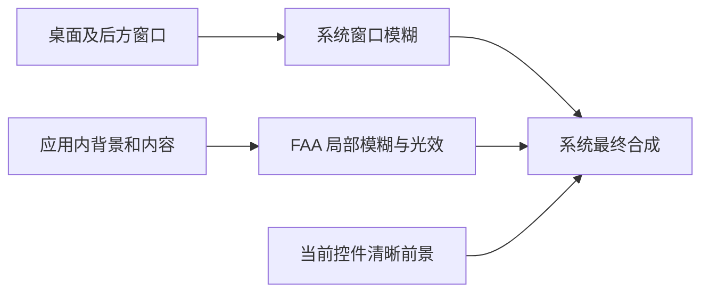
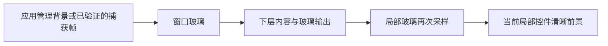
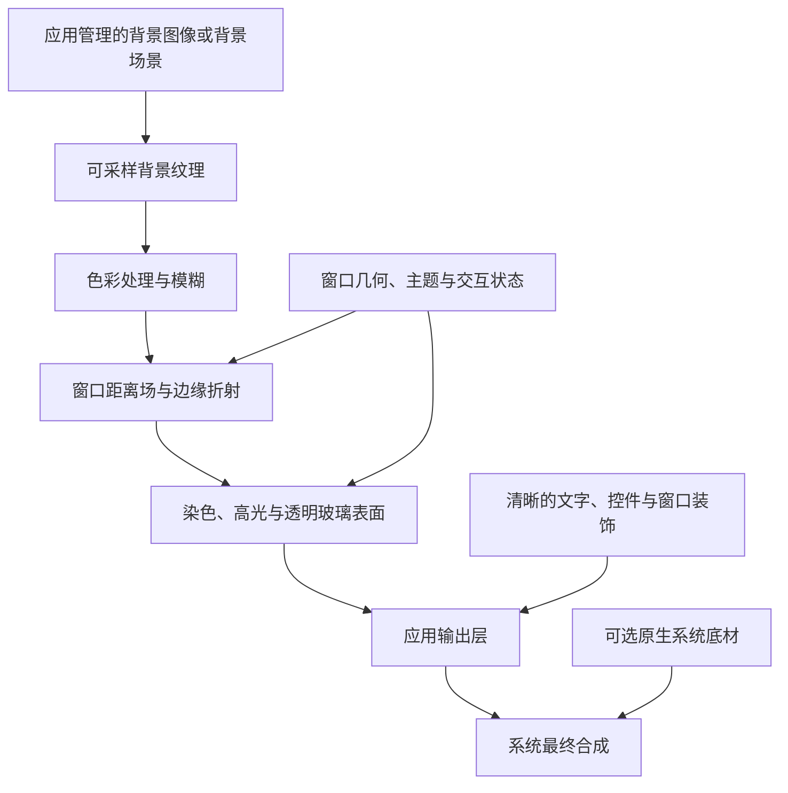

> 调研参考；不是已实现能力或已批准架构。已完成 FAA 的隔离 Windows Native AOT 发布与基础初始化；实际材质、整窗合成与其他平台仍待实机验证。

# 整窗材质渲染管线调研

本文区分三种能力：系统在窗口后绘制材质、应用可以读取并处理的背景像素，以及应用自身视觉树中的可采样内容。它们不能互相代替。以下平台结论来自官方文档与第一方协议源码；有关互操作、效果组合与维护成本的判断标为工程推断，不代表已完成集成。

## 当前方向：系统窗口磨砂与 FAA 局部材质

用户已进一步明确：设计语言是液态磨砂玻璃；粘连动效与光效比真实折射更重要。窗口模糊桌面，控件/容器模糊窗口内部内容；不要求多层玻璃逐层折射。FAA
优先保留，只有确认其 AOT 不支持或存在无法合理修复的缺陷后，才重新评估自研。用户所说的“上游”是 FAA 来源的
LiquidGlassAvaloniaUI 仓库，非 Avalonia 控件基类。

这组澄清替代下文此前整窗真实折射与自有 GlassScene 优先的推荐。先使用 Avalonia 系统窗口背景能力与 FAA，不为当前目标引入屏幕捕获、原生
shader Hook 或自研玻璃渲染；这些更高要求的技术资料仅保留为历史参考。AOT 优先、不 fork Avalonia、PC 三平台与明暗主题同步仍然适用。

### 两种模糊可以形成层次，但背景输入不同

系统窗口材质在窗口后方处理桌面；FAA 对应用自身的可采样视觉内容进行模糊，并在其上绘制当前控件前景。透明区域最终能与原生窗口材质合成，形成“窗体磨砂＋局部更柔和表面”的外观。但
FAA 快照中不包含系统 backdrop 输入，不能保证对已模糊的桌面图像再模糊一次。[F2]、[F3]、[F4]、[W3]

如果玻璃后方只是透明空白，FAA 不会自动得到桌面细节；增加 BlurRadius 也不会让系统桌面额外模糊。应以透明度、染色、边缘和光效建立局部层次，不能把这一限制写成
FAA 的 AOT 缺陷。

Windows 要模糊后方桌面应评估 AcrylicBlur/Blur 的实际支持；Mica 主要使用壁纸，不能据其名称承诺实时桌面模糊。[W4] macOS 可先使用
Avalonia 现有原生 Blur / NSVisualEffectView，无需为磨砂目标立即接入 NSGlassEffectView。Linux 默认提供稳定的雾面实色窗口和
FAA 应用内效果，不把系统桌面模糊设为必要能力；具体 compositor 增强另行验证。

### 从 PC 美学选择整窗材质

Apple 当前 HIG 将 Liquid Glass 定位为浮在内容之上的导航与操作层，并明确写出 “Don’t use Liquid Glass in the content layer”
和 “Use Liquid Glass effects sparingly”。应用背景属于更适合标准材质的内容层。[M9] 因此在 macOS 设计体系内，整窗 Liquid
Glass 不是普通应用窗口的默认方向；传统整窗磨砂与新 Liquid Glass 应分别讨论，这一设计建议也不是禁止应用使用整窗模糊。

建议采用“克制的磨砂窗壳＋稳定的内容基底＋局部流体反馈”。整窗磨砂可以作为身份与环境融合的选项，但不是液态动效和光效成立的前提。主窗口长时间阅读、编辑与密集数据区需稳定对比；小型工具、启动器或媒体窗口更适合较大范围的透明磨砂。窗口扩大后，背景变化不应成为内容区持续的视觉噪声。

| 区域                             | 建议承担的视觉职责                                           | 动效与光效重点                                           |
|----------------------------------|--------------------------------------------------------------|----------------------------------------------------------|
| 窗壳、标题栏与导航背景           | 连贯、低对比的雾面底材；系统模糊不可用时保留相同布局与层次   | 少量边缘光、激活状态变化；整窗保持安静，不随指针持续起伏 |
| 主内容区                         | 用较稳定的表面承载正文、编辑与数据，避免所有卡片重复玻璃嵌套 | 内容变化优先，必要时才出现局部表面反馈                   |
| 导航选中态、分段选项与共享指示层 | 让状态变化像同一块柔软表面迁移                               | 连续位移、适度拉伸、回弹和光线延续，构成粘连感           |
| 弹层与少量浮动操作               | 通过背景模糊和厚度表达前后关系                               | 与触发区域衔接的出现/收起、边缘光和阴影                  |
| 普通按钮与输入                   | 简洁表面与清晰可访问的状态                                   | 精细的悬停、按下、焦点反馈，避免每个控件都独立变形       |

这只是讨论中的方向，不是已确认的全局 token 数值。明暗主题与减少动画/透明度回退都应同步设计；跨平台统一层次、反馈和节奏，允许底材受系统能力影响。

FAA 已有按压/拖动弹簧变形、交互高光、Reveal 指针边缘光和视差等能力。[F7]、[F8] 它们可作为局部反馈的基础。多个独立轮廓真正连成一个液桥/融合形状，尚未在
FAA 现有 shader 中核到；可先以共享选中指示层的几何动画表达粘连，而非因此替换整个玻璃渲染。普通按钮仍使用 Avalonia
原控件，在模板中使用 FAA 材质，保留上游输入、焦点与命令契约；互动 Surface 的按压处理和 RenderTransform 需避免与业务拖动或模板动画争用。

### FAA 1.4.0 的 AOT：已有实际发布证据，尚未完成材质运行验证

隔离项目在工作区外使用 net10.0、Avalonia.Desktop 12.1.3 与 FAA 1.4.0，未使用 linker descriptor 或修改 FAA。已执行
`dotnet publish -c Release -r win-x64`，PublishAot=true，退出码 0，生成 native exe。随后执行该 exe
的无窗口初始化：AcrylicSurface、AcrylicInteractiveSurface、AcrylicParallaxSurface、AcrylicLensSurface
的构造、ApplyTemplate、Measure、Arrange 均成功，退出码 0。

发布仍有四条 FAA 裁剪警告：

- IL2075：对运行时 renderer 查找 SceneInvalidated 事件。
- IL2070：对事件参数查找 DirtyRect。
- IL2070 两条：对运行时 visual 查找 ClipToBoundsRadius，分别为 GetProperty/GetProperties。

源码未发现 DynamicMethod、Reflection.Emit 或 MakeGenericMethod 路径；两个反射文件集中在背景采样与圆角裁剪。[F3]、[F4]
因此现有证据不支持“FAA 无法 NativeAOT 发布”，也不足以宣布完整 AOT 兼容。编译和初始化没有验证真实背景更新、shader 加载、裁剪与
GPU 材质路径；四条警告说明分析器无法保证相关成员保留，并非已确认成员被裁除。应在动态背景窗口中核验实际行为；若确有裁剪导致的问题，再评估精准保留成员或小型上游修复。

上游库没有 AOT 支持声明/测试契约，其 CI 只做普通构建。Browser Demo 明确关闭 trimming，并注释裁剪构建可能白屏；这是另一 Demo
的上游声明，尚未隔离为 FAA 缺陷，不能拿来证明 PC NativeAOT 不支持。下一步应先验证 FAA 当前路径并评估小修复，未达到“需要自研替换”的证据门槛。

检查产物保存在临时目录 `vhilz-faa-aot-probe-1.4.0`：publish.log、init.log 与 native exe；不将编译器原始日志按日期追加到设计规范。此检查未验证本仓库整个
Demo 的 FAA/Lucide/SukiUI 依赖组合，也未验证 macOS/Linux RID，未添加仓库项目或更改依赖。

### FAA 是否完整包含原始上游仓库

比较对象固定为 FAA 1.4.0 提交 `013590eaa93666d368d775efdb3d7715591a4232` 与 LiquidGlassAvaloniaUI 当前核到的提交
`cde864d6efebc5b32484eb055900308ef4f65754`。[F8]、[U1]

| 核对范围       | 结果与边界                                                                                                                                                                                             |
|----------------|--------------------------------------------------------------------------------------------------------------------------------------------------------------------------------------------------------|
| 核心库源码     | 上游 13 个 C# 文件和 6 个 shader 在 FAA 中均有改名后的对应实现。并非所有文件原样保留；采样、交互和兼容处理已经修改。                                                                                   |
| 核心自定义属性 | LiquidGlassSurface 的 40 个、LiquidGlassInteractiveSurface 的 3 个 Avalonia 属性，FAA 均保留名称、类型和注册初始表达式（归一化类名后）；未发现缺项。此比对不替代行为与视觉回归。[U2]、[U3]、[F5]、[F7] |
| shader         | 六个均有对应文件，其中五个归一化后内容相同；主材质 shader 已扩展，不能称全库逐字一致。                                                                                                                 |
| FAA 新增能力   | Reveal 边缘光、Parallax、Lens，以及右键触发变形选项；不是从原上游直接继承的新增能力。[F8]                                                                                                              |
| 整个仓库       | 上游测试项目未带入 FAA；Demo 结构、示例资源、截图、文档及 CI/发布流程经过替换或重写。因此 FAA 不是上游仓库的完整镜像，也不是自动同步上游的兼容层。[U1]、[U4]、[F8]                                     |

准确结论是： **FAA 保留了已核核心库内容与两种核心 Surface
的自定义属性，并有扩展；不能说完整包含上游整个仓库或保证所有行为等效。** 两个包的命名空间、类型和依赖版本不同，不能原样互换全部
XAML/代码。是否采用 FAA 应依据本项目所需的背景模糊、光效与交互逐项核验，不以“fork”等同于删除功能或完全同步。

此前关于 ContentControl 默认模板未绑定 Padding/边框等继承属性的核对，属于另外一项 Avalonia 控件兼容性问题；原
LiquidGlassSurface 的模板同样如此，不应误报为 FAA 丢失原仓库功能。用户本轮澄清后的“上游完整性”判断采用上表范围。

## 历史参考：整窗与多层真实折射目标

> 下列路线按此前更高折射目标调研。当前推荐以本文开头的系统磨砂＋FAA 为准，自研、捕获和 Hook 尚未采用。

早期候选按以下边界评估：NativeAOT 优先，不 fork Avalonia；可以维护自有玻璃库，使用方式接近 FAA；macOS 可以采用原生材质，Windows
独立实现，Linux 不要求整窗玻璃。目标包含窗口与控件的玻璃、叠层折射及接近 Apple
的视觉。对这个更高目标，“系统底材＋独立自绘高光”的组合不足以覆盖完整连续折射，只能作为降级路线；对当前液态磨砂目标，系统底材＋FAA
已重新成为优先候选。

这些明确要求优先于仓库此前“限于应用内采样、全平台一致效果”的探索边界；本文评估扩展后的候选，但没有实施依赖变更或架构迁移。Avalonia
fork 已排除，不能作为后续遇到接入障碍时的默认补救。

可以开发独立 Avalonia 玻璃库，并用 FAA 和 LiquidGlassWinUI 的材质算法实现有真实像素重采样的玻璃。 **目前还不能承诺同时实现：Windows
后方桌面实时折射、任意 Avalonia 控件无改造互相折射、无需捕获、只用稳定公开 API。** AOT 本身不是这组目标的主要障碍，关键是背景来源、玻璃场景的层次和原生宿主接入。

### “相互折射”应明确到渲染行为

| 行为             | 含义                                                               | 可行性与边界                                                                                                                          |
|------------------|--------------------------------------------------------------------|---------------------------------------------------------------------------------------------------------------------------------------|
| 前后玻璃连续折射 | 背景先经过窗口玻璃，上层控件再采样该结果；叠层区域产生二次像素位移 | 自有管线取得明确输入后可以设计；必须按后到前生成中间结果，不能让两层循环采样最终窗口。新 Windows 参考未证明 Avalonia 集成或桌面输入。 |
| 近邻玻璃融合     | 相邻形状共享背景、法线或形状场，靠近时呈现融合/分离                | 可在自有场景中实现共享形状场；Apple 原生容器提供共享采样与融合，属于另一种行为。                                                      |
| 双向光学互作用   | 前后层互相改变彼此折射、含多次反射及完整光路                       | 不是 FAA 或新参考已有的屏幕空间算法，也不是 Apple 原生 API 已承诺的功能；若要求此级别，需要额外光学模型，不作为首版目标。             |

Apple 在 WWDC25 明确说明 “glass can’t directly sample other glass”；`NSGlassEffectContainerView`
通过共享采样区域协调外观和融合。[M6] 因此“近似 Apple”不意味着两张玻璃都把对方的最终颜色当输入。下文将连续折射与融合分别评估，原生与自绘后端不能冒充相同能力。

## LiquidGlassWinUI 的源码核对

新参考按提交 `647fd60c3ded87dc2a7472f813ec86a265529509` 核对。它提供了比 CompositionMaterial 更接近目标的自定义 HLSL
材质：超椭圆距离场、法线、背景 UV 位移、光谱采样、高光、模糊和颜色处理。[G2]、[G3] 这是屏幕空间像素折射的实现依据，不是完整物理光线追踪或
Apple 算法等价证明。

| 项目                           | 源码事实                                                                                                                                                                                        | 对自有 Avalonia 库的影响                                                                                                                                         |
|--------------------------------|-------------------------------------------------------------------------------------------------------------------------------------------------------------------------------------------------|------------------------------------------------------------------------------------------------------------------------------------------------------------------|
| 背景输入                       | `LiquidGlassBrush` 使用 `Microsoft.UI.Composition.Compositor.CreateBackdropBrush()`；Demo 的整窗 `SystemBackdrop` 仍是 `MicaBackdrop`。[G2]、[G6]                                               | 已有应用背景折射，不是“整窗已折射桌面”的证据；未发现 HostBackdrop、屏幕捕获或公开桌面纹理输入。                                                                  |
| 真实折射                       | shader 根据形状/法线计算 UV 偏移，并对偏移坐标采样背景；色散使用不同偏移位置的光谱颜色采样。[G3]                                                                                                | 可以借鉴材质数学；不同于只绘制彩色描边。                                                                                                                         |
| 任意 shader 如何进入原生合成器 | C++ 对 `wuceffectsi.dll` 固定 RVA 的 `EffectType::FromGuid` 做 inline patch，并修改本进程模块的 IAT/delay-IAT，拦截 `CompileEffectDescription`；构造与私有 vtable、字段布局匹配的编译结果。[G4] | 明确依赖非公共 ABI 及运行时 native 代码修补。Hook 在应用进程内，不能表述成已注入 `dwm.exe`。                                                                     |
| 系统与架构版本                 | 主 README 要求 Windows App SDK 2.2.0、x64；项目精确引用 2.2.0。包内 README 却写 2.2.0+，源码的固定偏移与字节检查不足以支持任意新版。[G1]、[G4]、[G5]                                            | 必须按已验证的具体二进制构建维护，未知版本拒绝启用；ARM64 需要重做 native 适配，不能认为重编译即可。                                                             |
| AOT                            | Demo 实际启用 `PublishAot=true`；类库通过 P/Invoke 调用 native runtime，未发现 CompositionMaterial 式 DynamicMethod 路径。[G5]、[G7]                                                            | 不是因 Hook/HLSL 就天然不兼容 NativeAOT。配置只证明项目有此意图，本轮没有发布或运行；WinRT 投影、互操作和自有接入仍需独立验证。                                  |
| 合成器不一致                   | 新参考使用 `Microsoft.UI.Composition`；Avalonia 12.1.3 激活的是 `Windows.UI.Composition.Compositor`。[G2]、[V8]                                                                                 | 不能把新库的 brush/visual 直接插入 CompositionMaterial 取得的合成树，也不能把 Hook 不变移植到 Avalonia 使用的系统模块。                                          |
| 多层与融合                     | 发布版 shader 明确只有单个圆角矩形，`MergeRate` 未使用；FlattenSource 将上游效果组合物化为中间纹理。[G3]、[G8]                                                                                  | 多源效果链不等于已有多块玻璃融合；多画刷叠层、整窗＋控件跨层采样仍须原型。README “无需离屏目标”只能理解为应用不自行管理这些目标，合成器仍有中间纹理与 GPU 成本。 |
| 失败处理                       | 托管连接捕获异常时返回红色 brush；native 指针和私有 ABI 错误不都能被该 catch 捕获。[G2]、[G4]                                                                                                   | 不能据此承诺 Hook 错配也不会崩溃。正式库需要能力探测、版本保护、稳定回退与资源释放。                                                                             |
| 许可                           | 仓库 MIT。[G9]                                                                                                                                                                                  | 允许按许可借鉴与移植，须保留相关版权声明；复用其上游算法时还需核对原始来源声明。                                                                                 |

**对此前结论的修正：** Windows 标准公开 Composition effect 集合不支持直接加入 Win2D `DisplacementMapEffect`，[W13]
但新参考利用私有合成器 ABI 另开了自定义 shader 通道。它证明需要评估这条实验路线，不能据此宣称公开 HostBackdrop 已可交给
FAA，也不能把其应用内背景效果推导成桌面折射已完成。

## 历史参考：更高折射目标下的候选路线

下面都是待原型的工程路线；“AOT 路线明确”不等于已经发布验证。所有方案均不 fork Avalonia。

| 路线                            | 整窗与控件能达到什么                                                                       | AOT / 非公共依赖                                                                                         | 优点                                                                       | 缺点                                                                                                                                                |
|---------------------------------|--------------------------------------------------------------------------------------------|----------------------------------------------------------------------------------------------------------|----------------------------------------------------------------------------|-----------------------------------------------------------------------------------------------------------------------------------------------------|
| A. 自有玻璃场景＋应用管理背景   | 窗口、局部玻璃共享自有背景，按后到前连续折射；同组形状可另做融合                           | 固定材质数据、Skia shader、公开绘制/快照接入；Skia lease 属公开但 Unstable API                           | 最容易控制 AOT、材质与层次；避免 Windows 合成器 Hook；可作为各平台共用核心 | 只折射应用管理的图像/内容；不能当作真实桌面整窗玻璃。任意控件背景需要显式场景层或子树快照，不能保证“套个 brush 即可全部正确”。                      |
| B. Windows 捕获输入＋路线 A     | 正确取得窗后图像时，可做桌面→窗口玻璃→局部玻璃的连续折射                                   | WGC/D3D 等公开 API＋固定 native C ABI；可设计为 AOT，不必维护系统 DLL Hook                               | 对玻璃模型最自由；能让整窗与控件使用同一份可采样数据                       | 排除自身后是否正确恢复被遮挡背景尚未实测；边框/权限、延迟、HDR、跨屏、设备丢失、纹理复制或导入成本。背景可用性是这条路线的首要可行性门槛。          |
| C. Windows 私有原生 shader 后端 | 在兼容合成器内做原生背景位移；若解决宿主与背景源，可以进一步研究整窗及原生玻璃层之间的叠层 | 固定 C ABI 可避开托管动态 IL，但需 LiquidGlassWinUI 类私有 native Hook；外加 Avalonia 接入或独立原生宿主 | 有实际代码参考，材质处理留在原生 GPU 合成链；不必先读回背景给 CPU          | SDK/内部模块/CPU 架构锁定；与 Avalonia 合成器不一致；桌面输入、分层 Avalonia 内容均未证明。非公共依赖最多，不建议成为默认发布后端。                 |
| D. 原生系统底材＋自绘玻璃外观   | 窗口有 Mica/Acrylic/原生模糊；应用内控件采用自有折射                                       | 优先公开窗口 API；若借鉴 CompositionMaterial 精细区域宿主，需移除动态 IL 并维护 Avalonia 私有适配        | 成本较低，适合作为稳定回退；能保留标准窗口行为                             | 不折射系统底材，窗口与局部玻璃不形成完整连续折射，不能作为完整目标的交付。                                                                          |
| E. macOS 26 原生玻璃后端        | 原生 NSGlassEffectView＋容器实现 Apple 外观、共享采样与融合                                | AppKit 公开 API＋固定 Objective-C/C ABI native bridge，可按 AOT 设计                                     | 苹果原生效果和系统偏好响应；无需复制 Apple shader                          | 玻璃不能直接采样另一块玻璃；Avalonia 每个控件不是原生 NSView。任意控件接入、整窗窗后背景和原生层次需实机验证；不保证与 Windows 连续折射逐像素一致。 |

当时的推荐是 **A 作为自有 Lib 的共用基础，E 作为 macOS 原生增强；Windows 是否达到真正桌面整窗折射，由 B 的背景原型决定。C
保留为独立实验后端，D 是降级。** Linux 仅提供 A 的应用内玻璃，按用户要求不承诺整窗桌面玻璃。若 Windows
必须同时无需捕获、真实窗后折射，则目前只有继续调查 C 一类私有路线的候选，没有已经证明满足全部约束的现成方案。

原生优先与统一算法是两个不同方向：允许 macOS 与 Windows
分别维护后，应该统一使用接口、主题与窗口行为，并按实际能力声明差异，不强求共用采样实现。若用户把“每个平台都进行连续二次折射”设为硬指标，macOS
也需要自有场景/捕获后端，不能只依赖原生玻璃容器。

### 拟定的自有库边界

以下名称只表达职责，尚非批准的对外 API：

- `GlassScene` 管理一个窗口中的玻璃形状、层次、背景来源、融合组与缓存；所有玻璃由同一场景协调，避免每个控件独立捕获整个窗口。
- `GlassSurface` 保持 FAA 式“包裹内容即可使用”的主要体验；上层声明圆角、厚度、折射、模糊和交互。普通控件逻辑、焦点、键盘、文本保持
  Avalonia 行为，玻璃只是模板中的材质层。
- `GlassGroup` 表达近邻共享采样/形状融合；融合与前后叠层是不同模式，不能把完整整窗和每个内嵌按钮全部合成一个外轮廓后还声称保留了每块玻璃边缘。
- 背景提供者区分应用背景、捕获帧和原生系统材质。原生系统材质不冒充可读纹理。对不可用的背景，明确进入外观回退。
- 平台后端单独打包：Skia 场景核心、Windows Capture、Windows Native 实验、macOS Native。Linux 使用场景核心；Windows 不需要加载
  macOS 绑定，常规模式不需要加载 Hook runtime。

Windows 自绘场景的连续折射路径为：

同一帧中先生成下层纹理再渲染上层，每层排除自身和前方内容；当前层的文字图标在其玻璃之后绘制。另一块更靠前的玻璃若覆盖这些文字，才把它们视为背景。融合模式单独在组内共享形状场/采样，不能由循环捕获模拟。

Avalonia 12.1.3 原生窗口把 swapchain surface 放在单个 sprite visual 上；CompositionMaterial
的材质容器插在它下方。[V6]、[C2] 这个排列中的原生材质不能看到上方 Avalonia surface
中的内容；即使后续实现原生玻璃之间的前后采样，也不会自动纳入这些内容。把原生玻璃移到上方则可能连当前控件文字也一起处理。解决任意交错层次需要受控视觉子树快照、拆分内容或额外原生宿主，而不是换一个
brush 即可。公开 `CreateCompositionVisualSnapshot`、`TryGetCompositionGpuInterop` 可用于评估部分接入，[V5]
但并不导出原生桌面背景，也不保证任意视觉子树实时、零拷贝、含原生控件地采样。

因此首版 API 可以接近 FAA，但实现契约应要求加入材质宿主，并标明哪些内容属于可采样背景；第三方原生控件、独立
Popup、独立装饰层需要单独适配。不能在未验证这些层次前声称可覆盖所有控件。

### AOT 与内部 API 分别控制

NativeAOT 不禁止所有反射。固定类型、保留必要 metadata 且已有调用代码的成员，反射查找/Invoke 可能成立；`MakeGenericMethod` 带
`RequiresDynamicCode` 和 `RequiresUnreferencedCode`，任意运行时泛型构造不应成为互操作契约。[A4]、[A5]

在本项目 net10.0 下，`UnsafeAccessor`/`UnsafeAccessorType` 可为部分固定成员生成 AOT stub，[A6]、[A7]、[A8] 但不支持不可访问值类型和
byref 返回，不能把不可访问类型的字段统一改成 `ref object`。[A9] CompositionMaterial 的 `DynamicMethod` 必须移除；Windows/macOS
的 native 对象创建、调用和释放尽量放入固定 C ABI 桥接层，托管只传参数与句柄。这是候选设计，不能替代实际 Native AOT 发布验证。

HLSL/SkSL 的 native shader 编译不等于 .NET Reflection.Emit。native Hook 也不意味着一定需要 JIT；它可能与托管 NativeAOT
并存，但仍有独立的版本、进程内修补与可靠性问题。 **兼容 AOT、只用公共 API、可折射桌面是三项独立指标。**

### 原型顺序与淘汰标准

1. 验证现有 Demo 的 Native AOT 基线，列出 FAA、Lucide、SukiUI 等实际诊断；不为发布成功擅自移除已确认保留的依赖。然后做不改产品架构的独立原型。
2. 用明确彩色图像验证路线 A：一层窗口玻璃＋移动的局部玻璃；证明上层采样下层输出，另做同组融合例子，保持当前控件文本清晰。明暗主题、AOT
   发布均在这个最小原型中检查。
3. Windows 优先验证路线 B 最危险的假设：排除自身后，窗口不隐藏时，后方运动内容能否正确取得；检查边框/许可体验、移动/跨屏、HDR
   与延迟。如果输入失败，不能靠优化 shader 宣布整窗目标完成。
4. 若需继续研究路线 C，先证明同一兼容合成器能运行自定义 shader，再证明实际窗后输入与两层玻璃；最后解决 Avalonia
   内容的层次。未通过前，不复制整套 Hook 到主库，也不以 fork 作为补救。
5. macOS 在 macOS 26 实机单独验证原生 contentView 包装、容器融合、背景范围和整窗覆盖；旧版系统采用 NSVisualEffectView
   或场景核心回退。Windows/macOS 分别通过 RID 发布与实际材质路径运行后才报告 AOT 支持。
6. 测量高 DPI、窗口缩放/最大化/全屏、GPU 回退和设备丢失下的帧时间、纹理内存、复制量；同时核查独立标题栏/弹层、隐藏和关闭释放。Headless
   仅验证结构与行为，材质最终由用户运行验收。

上述自研路线仅完成源码与资料调研，没有实现或运行新参考。另已完成本文开头记录的 FAA 隔离 Windows Native AOT
发布与基础初始化。没有修改产品代码或仓库依赖；窗口桌面折射、连续叠层、原生融合、各平台性能和自研路线的
AOT 支持均待上述原型验证。

## CompositionMaterial.Avalonia 提供的原生路线参考

用户提供的 [CompositionMaterial.Avalonia](https://github.com/HelloWRC/CompositionMaterial.Avalonia) 已按提交
`f9b66c197007c6e1ccfce4e89bb9ce64f75e04b3` 核对。它为前述 Windows 原生材质路线提供了具体的 Avalonia
接入实现，值得作为窗口材质宿主的设计参考；它没有将系统背景导出给 FAA，也没有实现 FAA 式真实位移折射。

其关键路径是： **系统 backdrop/wallpaper brush → Windows 原生材质 visual → 插入 Avalonia swapchain visual 下方；Avalonia
在上方绘制染色、高光与清晰内容。** `NativeWindowContext` 从 Avalonia 的 WinUI 后端取得现有原生 compositor，在原生根容器中调用
`InsertBelow(hostVisual, swapchainVisual)`。[C2] 这条原生底材路径不使用 FAA 的
`RenderTargetBitmap → CopyPixels → SKImage` 背景复制链，但整窗性能优势仍需测量，不能把源码结构当成实测结论。

| 核对项目                | 源码事实与影响                                                                                                                                                                                                                                                                                                                                         |
|-------------------------|--------------------------------------------------------------------------------------------------------------------------------------------------------------------------------------------------------------------------------------------------------------------------------------------------------------------------------------------------------|
| 平台与版本              | 项目声明仅支持 Windows，NuGet 将 Avalonia/Avalonia.Win32 精确约束为 `[12.1.1]`；`WinUiAbi.TryCreate` 也检查两个程序集必须为 `12.1.1.0`，不符即返回 null。本仓库为 12.1.3，不能按当前实现直接取得原生后端，需要移植并验证，不能只删除版本保护。[C1]、[C4]、[C8]                                                                                         |
| NativeAOT               | `FastReflection` 用 `DynamicMethod`、`ILGenerator` 和 `System.Reflection.Emit` 生成访问器、setter 及 server job 调用。当前路径明确不支持 NativeAOT；`ILLink.Descriptors.xml` 保留 metadata 只能应对裁剪，不能消除运行时 IL 生成。[C3]、[C9]、[A1]                                                                                                      |
| Avalonia 私有接入       | 读取 `_glSurface`、`_window`、`_target`、`_shared`、`_visual` 等内部字段，反射订阅 `Compositor.AfterCommit`，调用 `PostServerJob` 并读取 server visual/动画状态。升级耦合涵盖平台桥接和渲染生命周期，范围比仅使用公开 Skia lease 更深。[C2]、[C4]、[C5]                                                                                                |
| 公开系统 API            | 启用 HostBackdrop 的 `DWMWA_USE_HOSTBACKDROPBRUSH` 与 DWM 调用属于公开系统能力；Windows 的 blurred wallpaper backdrop brush 也有公开 Composition API。不能把这条路线的所有 OS API 统称为非公开，主要非公共依赖在 Avalonia 的接入层。[C10]、[W2]、[W12]                                                                                                 |
| Liquid Glass 的实际行为 | 原生侧主要是 HostBackdrop 与低不透明度 Acrylic 磨砂层；Avalonia 侧绘制透明染色、渐变边缘、指针高光与噪声。`ChromaticAberration` 调整青色/品红色高光与描边，不分离、偏移背景像素的 RGB 采样。README 明确不实现真实位移、折射或色散。[C1]、[C6]、[C7]                                                                                                    |
| 自定义材质图的实际范围  | `CompileCustomBase` 校验材质图后，有 GaussianBlur 节点时选择 Avalonia 内部 Acrylic 配方，否则查找 backdrop 并创建背景 brush；并非把每种节点编译成独立的 Windows effect。纯色、渐变、噪声、叠色及部分蒙版在 Avalonia 覆盖层绘制，不能据节点名称承诺任意系统背景滤镜；README 亦说明 BlurAmount/Saturation 不对应任意可动画化的原生参数。[C1]、[C6]、[C7] |
| 来源与层次              | 项目采样系统背景，不采样同一 swapchain 内的 Avalonia 内容。原生材质位于 Avalonia 输出下方，不透明窗口背景或祖先绘制会遮住它；它不会自动给上层像素打孔。HostBackdrop/Wallpaper 创建失败还可能回退至普通 Backdrop，接入时应明确能力语义。[C1]、[C2]、[C6]                                                                                                |
| 形状与窗口适配          | 现有实现面向控件区域；其原生圆角取保守的统一半径。扩大到窗口仍需验证独立装饰层、全屏顶栏、最大化边界、跨屏 DPI、裁剪与原生阴影，不能把控件可显示等同于整窗契约已满足。[C1]、[C5]                                                                                                                                                                       |

对方案的修正是： **Windows 原生材质宿主已有可读的工程参考，应作为明确候选评估。** 对以 Windows 效果为优先的实验版本，可借鉴其系统背景与
Avalonia 前景分层；FAA 继续承担应用内可采样内容的折射。对同时要求
NativeAOT、长期升级和多平台一致性的版本，则需要设计范围更小的静态接入或推动框架提供公开扩展点，不能直接继承该项目全部私有
ABI 和动态代码路径。

这份参考没有解决“把 FAA 的 SkSL 直接作用于 HostBackdrop/Mica”的输入问题。若继续追求系统背景真实折射，仍须验证 Windows
Composition 的公开效果集合是否能表达目标算法，或采用另一条可取得纹理的输入路线。把 `DynamicMethod` 改成普通反射也不能独自完成
AOT 改造：内部 metadata、运行时泛型 COM 查询、帧同步和 native 接入都需逐项验证。

进一步核对材质图时，`SaturationBrushNode` 在覆盖层只递归到 source，`BlendBrushNode` 顺序绘制前后景而未使用 `Mode`
；Opacity/Tint/Mask 也只处理覆盖层。这些声明不能作为系统背景已支持完整滤镜与混合模式的证据。[C6]、[C7] 与 FAA
衔接时应按实际能力报告，不让相同的节点名称暗示两个后端行为一致。

本轮仅核对源码并更新本文，没有添加 CompositionMaterial 依赖、降低 Avalonia 版本或运行该项目；其原生显示、整窗性能、AOT 改造及本仓库
12.1.3 兼容性仍未实测。

## 当前 FAA 与 Avalonia 源码证据

按工作区的依赖版本核对：FAA 1.4.0 对应提交 `013590eaa93666d368d775efdb3d7715591a4232`；Avalonia 12.1.3 对应提交
`8eeda4f6f546165b3f72e63c9f42247abb306905`。提交来源为已安装 NuGet 包的 repository 元数据，不用上游 main 的新代码替代当前版本。

| 源码事实                                                                                                                                                           | 对整窗管线的影响                                                                                                                           |
|--------------------------------------------------------------------------------------------------------------------------------------------------------------------|--------------------------------------------------------------------------------------------------------------------------------------------|
| FAA 的 `AcrylicShader.sksl` 用圆角矩形距离场计算边缘梯度，再以偏移坐标采样 `content`；中央区域保持原采样，也有色散与局部透镜分支。[F1]                             | 可复用屏幕空间折射的算法基础，但它不是完整的物理光学模拟；没有背景纹理时，偏移坐标不会凭空取得桌面细节                                     |
| `AcrylicDrawOperation` 使用 `ICustomDrawOperation`、`ISkiaSharpApiLeaseFeature`、`SKRuntimeEffect` 与 `SKImageFilter`，有 GPU 滤镜 surface 和 CPU 回退。[F2]       | 材质着色器和滤镜处理可以作为自有渲染核心的参考；采用 Skia 不等于每条路径都在 GPU 上运行                                                    |
| `AcrylicBackdropProvider` 反射取得 `TopLevel.Renderer`、`SceneInvalidated` 与 `DirtyRect`；`AcrylicVisualRenderer` 反射圆角裁剪属性。[F3]、[F4]                    | 内部成员版本耦合和 metadata 裁剪风险已经存在，直接沿用这套采样会继承风险；反射缺失可能表现为背景不再及时更新或裁剪差异                     |
| 采样遍历应用 visual 到 `RenderTargetBitmap`，再调用 `Bitmap.CopyPixels` 与 `SKImage.FromPixelCopy`；捕获间隔控制以 33 ms 为基准。[F3]                              | 整窗内容变化会放大像素复制成本；GPU 滤镜不能消除前面的 CPU 像素复制，后台采样与前景动画的时序也需重新设计                                  |
| FAA 的采样提供者、快照、draw operation 与 `CreateDrawParameters` 等关键接入是 `internal`，未核到公开的外部背景纹理注入契约。[F2]、[F3]、[F5]                       | 单纯继承 `AcrylicSurface`、加窗口样式，不足以替换输入与调度；更适合抽取许可允许的算法源码，在自有玻璃库中维护输入与调度                    |
| Avalonia 的 `TopLevel.Renderer` 为 `internal`；Skia lease 接口是 `public`，但明确标记 `[Unstable]`。[V1]、[V2]                                                     | 必须区分非公共 API 与公开但不稳定 API；移除反射后仍需检查图形接入的升级兼容                                                                |
| Avalonia 12.1.3 提供公开 `ElementComposition.GetElementVisual`、`CompositionCustomVisualHandler` 和 `Compositor.CreateCompositionVisualSnapshot`。[V3]、[V4]、[V5] | 自有背景 visual 的采样与渲染调度有公开候选入口，可减少访问内部渲染器的需要；公开 snapshot 返回 Bitmap，不构成已验证的零拷贝纹理导出承诺    |
| 当前 Win32 后端将原生背景 visual 与承载 Avalonia 内容的 surface visual 分层，`WinUiCompositedWindow` 等接入类型为 `internal`。[V6]、[V7]                           | 公开 `TransparencyLevelHint` 可以请求系统底材；深入修改框架持有的 Windows Composition 树会涉及内部实现耦合，不能把它描述为一个普通样式扩展 |

FAA 与原始 LiquidGlassAvaloniaUI 采用 MIT 许可。复制或修改其源码、shader
的相关部分时，需要保留两者现有版权与许可声明；同时由本项目承担复制部分的升级、修复与归属维护。[F6]

## 自绘核心与系统底材降级的分层细节

建议先研究共用 Skia 材质宿主，将“背景来源”“玻璃处理”“清晰前景”分开。下面是待原型的分层，模块名称仅用于说明职责，不是已确定的对外
API。

原生底材只进入系统最终合成，没有指向背景纹理的箭头。拥有真实纹理时可以做背景折射；只有原生底材时，自定义层仍能绘制玻璃外观，但其纹理细节没有被共用
shader 重采样。

1. **每个窗口管理一份材质状态。** 统一客户区、标题栏与自绘装饰的几何基准、主题、激活状态和交互输入。多个局部层可复用这份状态，但不假定它们位于同一视觉分支；本仓库的
   Avalonia 12 装饰层已经有独立采样限制，见 `CaptionSurface.Render`。[R1]
2. **背景输入具有明确来源。** 先支持应用管理的图像或专门背景场景。需要采样 visual 时，评估公开 snapshot
   或自有背景绘制路径；不捕获完整窗口再拿它作为自身背景。窗口材质与清晰前景不参与自己的背景输入，避免递归、重复染色和文字残影。任意第三方
   visual 的持续脏区跟踪仍需验证，不能仅因有 snapshot 方法就承诺完整替代 FAA 的跟踪功能。
3. **用窗口形状驱动材质。** 以圆角矩形距离场生成边缘厚度与法线，复用 FAA
   的边缘折射思想，针对整窗面积收敛位移、高光与色散。缩放、最大化和全屏改变几何时重新计算；窗口中央保持可读，不对全部前景文字做整窗后处理。这里只是候选视觉方向，明暗参数均待实际验收。
4. **自有采样和调度。** 材质输入、滤镜缓存和输出分层更新；只在有输入或动画变化时请求帧。尽量在同一图形上下文内复用纹理，必要时提供复制路径与质量降级，不承诺当前公开
   API 能保证零拷贝。渲染线程读取固定的状态快照，不直接遍历 UI 线程中的可变控件。
5. **保留窗口行为。** 自绘材质不替换 Avalonia 的拖动、缩放、键盘与窗口状态契约。自绘圆角遮罩、原生窗口边界、缩放命中区域与系统阴影需要一起核查；不能将视觉上透明的像素自动当作应穿透输入的区域。独立
   Popup、模态窗口与原生宿主不能假定共享主窗口的同一张背景纹理。

这套方案可按 AOT 友好的方式实现采样与状态传递，且不要求为各 OS 复制整套玻璃算法。它仍依赖 Skia 的原生 assets
和图形后端，最终兼容性需要发布与实机结果确认。系统底材、原生效果图及捕获输入作为可选接入分别评估，避免让默认材质要求平台捕获能力。

## 对工程和产品的影响

| 影响                | 何时发生                                                                      | 候选处理与剩余限制                                                                                                                                                                                                                   |
|---------------------|-------------------------------------------------------------------------------|--------------------------------------------------------------------------------------------------------------------------------------------------------------------------------------------------------------------------------------|
| AOT 与裁剪          | 复用 FAA 反射采样、动态 native 投影或内建 COM 互操作时                        | 优先静态引用、明确数据结构和 AOT 友好的互操作；保留 metadata 仅缓解裁剪，不解决内部契约变化。不能用 JIT 构建通过代替 Native AOT 发布验证                                                                                             |
| API 稳定性          | Skia lease 的 `[Unstable]` 接入；深入修改 Avalonia 原生 compositor 时风险更高 | 固定兼容范围、集中接入代码并做升级回归。首版不以反射修改平台 composition 树为前提                                                                                                                                                    |
| 自有算法源码维护    | FAA 核心采样与绘制接入为 internal，需要自有输入和调度时                       | 只抽取确实复用的算法并保留许可；跟踪相关上游修复，明确哪些行为已偏离 FAA。继续引用原包也不会自动更新复制的 shader                                                                                                                    |
| CPU/GPU 与电量      | 整窗多遍滤镜、持续捕获、色散多点采样、动画和 CPU 回退时                       | 复用 surface、降低模糊输入分辨率、按变化更新、设置质量档位；4K 与高 DPI 下需实际测量，不能据控件级效果推断整窗流畅                                                                                                                   |
| 内存与复制带宽      | 高分辨率纹理及多个缓存/中间 surface 时                                        | 按实际物理像素设预算；尺寸改变及时回收，关闭窗口停止帧请求。估算一张 3840×2160 RGBA8 纹理约 31.6 MiB；三张约 95 MiB，尚未计入其他缓存。60 fps 每帧复制一次该尺寸像素约 2 GB/s，未计滤镜、额外复制和 GPU 上传；此为数量级估算，非实测 |
| 线程与 GPU 生命周期 | UI/渲染线程交换状态，缩放重建 surface 或设备上下文变化时                      | 明确快照、缓存、纹理的所有权和销毁时机；窗口隐藏/关闭、device lost、切换显示器与尺寸突变均需回归                                                                                                                                     |
| 多平台维护          | 采用系统底材、平台原生玻璃或外部捕获时                                        | 共用材质数学与参数；Windows、macOS、Linux 的背景接入分别维护，Linux 还要区分 Wayland/X11 和 compositor。系统效果外观无法保证逐像素一致                                                                                               |
| 用户体验与可访问性  | 动态背景降低文字对比度、持续动画、系统减少透明度/动画或捕获授权时             | 明暗同步提供稳定回退，保持清晰前景，并响应系统偏好。桌面捕获的选择、权限撤销与提示属于产品流程，不能藏在普通主题加载里                                                                                                               |
| 窗口与特殊内容兼容  | 独立装饰、Popup/模态窗口、跨屏 DPI、原生控件与独立合成内容时                  | 分别核查接入与坐标；不能未经验证就承诺所有内容都能被 visual snapshot 捕获并参与同一材质                                                                                                                                              |

建议原型首先验证一个明暗俱全的整窗材质宿主：受控彩色背景、透明系统底材两种模式，清晰前景，客户区与标题栏连贯，最大化/全屏/DPI
切换与关闭释放。之后验证选定 RID 的 Native AOT 发布，测量帧耗时、复制量和峰值内存，再决定是否增加原生平台或捕获增强。Headless
只适合结构与生命周期回归；折射、高光、模糊、动画与视觉一致性仍需实际观察。

## 原生平台路线与能力边界

公开接口并不意味着可以取得任意系统材质的像素。Windows 与 macOS
均有公开原生背景效果，也均有公开屏幕捕获接口；捕获接口输出的是被选择或指定的捕获源，不是统一的“当前窗口绘制之前的系统背景纹理”。Linux
需要继续区分 Wayland、X11 和具体 compositor。不能把结论写成“所有平台都没有任何公开背景像素获取途径”，也不能反向承诺“可以读出
Mica framebuffer”。

| 路线                                           | 已核对的公开能力                                                                                                               | 能否直接作为 FAA/Skia 自定义 shader 输入                                           | 主要边界与维护成本                                                                                                      |
|------------------------------------------------|--------------------------------------------------------------------------------------------------------------------------------|------------------------------------------------------------------------------------|-------------------------------------------------------------------------------------------------------------------------|
| Windows DWM 系统背景                           | 整窗 Mica、Desktop Acrylic、Mica Alt；`DWMWA_SYSTEMBACKDROP_TYPE` 从 Windows 11 Build 22621 支持。[W1]、[W2]                   | 该 API 只指定系统绘制材质，没有给应用背景纹理的导出契约。                          | 材质由系统决定，可随系统版本变化；不等于实时折射窗口后其他应用。                                                        |
| Windows HostBackdrop + 原生 Composition 效果图 | 公开 `CreateHostBackdropBrush` 可以采样本窗口绘制前的背景；Win32 从 Windows 11 Build 22000 可通过公开 DWM 标志启用。[W2]、[W3] | 文档明确禁止应用读回该 brush 的像素；因此不能直接交给 FAA/Skia。[W3]               | 可另建 Windows 原生效果管线。任意折射能否经公开效果接口实现尚未验证；需维护原生合成树、窗口与 Avalonia 内容的层次关系。 |
| Windows Graphics Capture                       | 公开窗口/显示器帧捕获，输出 Direct3D surface；桌面互操作可按 `HWND`/`HMONITOR` 创建捕获对象。[W6]、[W7]                        | 有像素输出，理论上可以经过复制或互操作成为图像输入；未验证 Skia 导入与零拷贝。     | 捕获提示、能力检查、排除自身、HDR、帧生命周期、窗口移动与设备丢失；不保证还原本窗口遮挡的背景。                         |
| macOS `NSVisualEffectView`                     | 公开 `behindWindow` 模式可混合、模糊桌面与其他窗口内容。[M1]、[M2]                                                             | 已核对的 API 提供视图效果与材质配置，未提供背景纹理导出契约。                      | 原生 AppKit 视图与 Avalonia 绘制内容的集成；系统设置与材质版本差异。                                                    |
| macOS 26 `NSGlassEffectView`                   | 公开 AppKit 动态玻璃视图，支持样式、着色、圆角与交互反馈。[M3]                                                                 | 已核对的 API 不提供给 FAA 的纹理导出契约；不能把原生显示效果等同于读取其底层采样。 | 可作为 macOS 原生 Liquid Glass 候选；最低系统版本、层次集成和其他平台的一致方案尚需验证。                               |
| macOS ScreenCaptureKit                         | 公开屏幕捕获，能按应用/窗口过滤，输出具有 `IOSurface` 的像素缓冲。[M4]                                                         | 有像素输出；如何导入 Avalonia/Skia、同步与回收尚未验证。                           | Screen Recording 权限或系统内容选择流程、异步帧、排除自身、DPI/色彩空间与 native bridge。                               |
| Linux Wayland compositor 效果                  | 例如 KDE 公开协议可以向 compositor 请求某个 surface 区域的 blur。[L3]                                                          | 请求系统效果不等于得到纹理；该 blur 协议不返回像素。                               | 非统一 Wayland 核心材质 API，需要 compositor 能力判断与降级。                                                           |
| Linux Wayland Portal 捕获                      | ScreenCast Portal 返回 PipeWire 流，可选择显示器/窗口，支持条件性的持久权限与恢复 token。[L1]                                  | 有捕获像素路径；格式与 GPU 导入需另做实现和验证。                                  | 通常涉及用户选择；后端行为不同，标准 Portal 未提供排除某个应用的通用选项；需要处理捕获反馈。                            |
| Linux X11 Composite                            | 公开 `XCompositeNameWindowPixmap` 可取得已重定向、可见窗口的离屏存储 pixmap。[L4]                                              | 存在公开的窗口像素路线，但不是已验证的 Avalonia/Skia 输入方案。                    | 需要 Composite 扩展、窗口生命周期、尺寸变化及 compositor 关系处理；无法把此能力当作 Wayland 的能力。                    |

## Windows：公开系统效果与可读纹理的区别

### DWM Mica 与 Acrylic

`DWM_SYSTEMBACKDROP_TYPE` 是公开枚举。`DWMSBT_MAINWINDOW` 在 Windows 11 对应 Mica，`DWMSBT_TRANSIENTWINDOW` 对应 Desktop
Acrylic，`DWMSBT_TABBEDWINDOW` 对应 Mica Alt。文档分别规定它们可以覆盖整个窗口边界，并明确未来 Windows
版本可能更换实际材质。[W1] `DWMWA_SYSTEMBACKDROP_TYPE` 支持从 Windows 11 Build 22621 开始，不应将旧版本上的非公开
attribute 值与这个公开契约混为一谈。[W2]

Mica 是不透明的动态材质；微软说明它把主题和桌面壁纸融入背景，并只采样壁纸一次以降低成本。因此，Mica
不是一个持续包含窗口后其他应用画面的实时纹理来源。[W4] 系统绘制 Mica 的能力也不表示应用获得了这个材质的
framebuffer。本文未找到并验证公开的 DWM Mica 像素导出接口，不承诺通过截图或窗口帧捕获即可得到可用于折射的 Mica 像素。

### HostBackdropBrush 并非非公开 API

`Windows.UI.Composition.Compositor.CreateHostBackdropBrush` 是公开 WinRT API，文档标注从 Windows 10 Creators Update /
10.0.15063.0、`UniversalApiContract` v4 起引入。它的采样语义是“窗口绘制之前、visual 后面的区域”。但其 Remarks 明确写出：
**“The app cannot read the pixel data back.”** 透明度还受用户设置和电源策略控制。[W3]

Win32 使用此能力还需区分 API 可用与窗口宿主支持。公开的 `DWMWA_USE_HOSTBACKDROPBRUSH` 从 Windows 11 Build 22000 起允许非
UWP 窗口使用 host backdrop brush；微软直接说明 Win32 程序可结合 `Windows::UI::Composition` 构造透明效果。[W2]
这条路径本身不需要笼统标成“依赖 undocumented API”。

`CompositionBackdropBrush` 可以作为 `CompositionEffectBrush` 效果源。微软示例把 backdrop brush 绑定到高斯模糊效果；原生
Composition 也允许描述、组合和动画化所支持的效果图。[W5]、[W10] 因而可以另建 Windows 原生材质管线，不能因为无法读回像素就断言原生
Composition 绝不支持任何折射类效果。不过，本次未验证 FAA 式任意 SkSL、位移贴图与自定义折射算法能否通过公开的原生效果集合表达，不能承诺效果等价。

另一个边界是 compositor 身份：`Windows.UI.Composition.Compositor` 是 Windows 原生系统合成 API，不能因名称相似就把它当成
Avalonia 的 compositor，也没有据此形成可直接互换 brush/visual/texture 的契约。微软说明桌面 Visual Layer 与其他 UI
技术混用时，各自绘制自己的像素，并存在合成层次及 DPI 集成问题。[W11] 将此路线嵌入 Avalonia 的具体可行性属于后续原型范围，不能推导出全平台纹理桥接。

### Windows Graphics Capture 是捕获管线

微软的常规 Screen Capture 指南通过 `GraphicsCapturePicker` 让用户在安全系统 UI 中选择窗口或显示器，并说明系统通常绘制捕获边框。帧包含
`Direct3D11CaptureFrame.Surface`，因此这条路线确实提供可处理的像素。[W6]

但不能反过来声称每个 Win32 捕获都强制使用 Picker。公开 `IGraphicsCaptureItemInterop` 从 Windows 10 1903 / Build 18362 起提供
`CreateForWindow` 与 `CreateForMonitor`，可按已有窗口或显示器句柄指定源。[W7] 具体宿主、打包形式、OS
版本及用户策略需要核对，不能把桌面互操作路径概括成跨平台、无需用户感知的实时背景接口。

关闭彩色捕获边框另有独立约束：`IsBorderRequired=false` 需要通过 `GraphicsCaptureAccess.RequestAccessAsync(Borderless)`
请求用户同意，文档还要求声明 `graphicsCaptureWithoutBorder` 包能力；拒绝时 setter 可成功但会被忽略。[W8]

工程上，显示器捕获通常包含当前窗口已经绘制的结果。如果再将它作为该窗口的背景，就可能产生递归反馈；截取屏幕区域也不等于取得被当前窗口遮住的其他窗口像素。公开
`SetWindowDisplayAffinity(WDA_EXCLUDEFROMCAPTURE)` 从 Windows 10 2004
起允许排除本进程顶层窗口，可作为处理自身捕获的候选手段。[W9] 但其文档不是“返回该窗口不存在时的完整 DWM
背景”的承诺，也不应在没有实测的情况下保证被遮挡内容、Mica 或 Acrylic 最终材质全部正确恢复。旧版 OS 对此值的行为亦不同。

此外，微软要求捕获帧归还池后不要继续持有该 frame 或底层 surface，HDR 捕获需匹配浮点格式或做 tone mapping；尺寸变化与 device
lost 需要重建 frame pool。[W6] 这些是独立视频/捕获系统的生命周期负担，不是为主题 brush 增加一个纹理 setter 就能消除的细节。

## macOS：原生玻璃、融合与整窗的不同边界

`NSVisualEffectView.BlendingMode.behindWindow` 公开承诺混合和模糊桌面/其他窗口；Avalonia 12.1.3 的原生
`AutoFitContentView` 也用这个模式构造窗口模糊层。[M1]、[M2]、[V11] 这证明整窗原生毛玻璃有明确背景语义，不等于 macOS 26 新
Liquid Glass 的桌面折射。

`NSGlassEffectView` 是 macOS 26 的公开 NSView，支持 `contentView`、`cornerRadius`、`effectIsInteractive`、`style`、
`tintColor`。[M3] 它不是 NSVisualEffectView；已核公开属性没有 `behindWindow` / `blendingMode`，也没有给 FAA/Skia
的背景纹理导出接口。它可以做成客户区大小的形状，但不能据尺寸推定具有桌面/其他窗口采样。此处是有限的公开资料核对，不是断言系统内部绝不使用窗口外信息。

Apple WWDC25 要求每个自定义玻璃元素创建一个 NSGlassEffectView，以 `contentView` 包裹前景，并明确建议不要把玻璃放在与前景平级的后方
sibling view。[M6] contentView 文档只保证该内容位于玻璃内部，任意 subview 相对玻璃/内容的 z-order 没有保证。[M8] 因此简单把原生玻璃当
Avalonia 背景 brush 插入视图树，缺少上游层次保证。

多个近邻元素可置于 `NSGlassEffectContainerView.contentView` 中，用 `spacing` 控制融合；官方说明 “glass can’t directly
sample other glass”，容器使玻璃共享采样区域，并用 “one sampling pass for the entire group” 统一效果。[M6]、[M7]
这是原生共享采样/融合，不是逐层二次折射，也不会自动识别 FAA shader 已绘制的玻璃。

不 fork 的接入有具体候选：`TopLevel.TryGetPlatformHandle()` 是公开方法；public 但标记 `[Unstable]` 的
`IMacOSTopLevelPlatformHandle` 能取得 NSView/NSWindow。[V1]、[V9] 可编译单独 Objective-C++ dylib，通过固定 C ABI 与
source-generated `LibraryImport` 创建、更新和释放公开 AppKit 视图，[A10] 避免托管动态投影与私有字段查找。Objective-C native
dispatch 不是托管 Reflection.Emit；仍需维护 arm64/x64 native 打包、签名、retain/release、AppKit 主线程与系统版本降级。

Avalonia 原生 `AvnView.setRenderTarget` 设置其单个 CALayer，普通控件已合成到该面；`canDrawSubviewsIntoLayer=NO`。[V10] 整块
AvnView 作为一个大玻璃的 contentView，在类型上可行，但重排视图可能影响上游窗口容器、布局、焦点、标题栏、全屏与关闭释放，不能因可取
handle 就承诺稳定整窗接入。原生自适应 NSAppearance 也不会自动给 Skia 已绘制的文字换主题 token。

控件级可以研究公开 NativeControlHost 创建 NSView，但原生 holder 被加到 AvnView 的 subviews 中，[V12]、[V13] 不能把一个 Skia
面中的任意控件文字穿插到各原生玻璃的前后。正确的 contentView 包装可能需要分区前景/额外嵌入宿主；每个控件独立 NSView
不等于必须改用 AppKit 标准控件，但需要分别承载其前景绘制与输入。跨原生/Skia 采样、裁剪、滚动和交互均待实机。

ScreenCaptureKit 是另一类公开输入：官方示例可过滤/排除应用，提供 IOSurface 支撑的像素缓冲；它涉及 Screen Recording
权限或系统选择流程。[M4]、[M5] 若 macOS 也必须对窗后图像做自定义连续折射，可以独立评估这条自有管线；不把它与无需导出纹理的原生融合混为一谈。

## Linux：Wayland 与 X11 分别评估

Wayland 官方架构说明客户端渲染并提交自身 buffer，由 compositor 组合最终屏幕。[L2] 核心客户端 buffer 提交机制不等于把
compositor 已合成的其他客户端画面读回。额外的捕获或材质能力需要查询平台扩展和实际 compositor；本次结论不排除其他公开扩展的存在。

例如 KDE 第一方 `org_kde_kwin_blur_manager` 协议可给指定 `wl_surface` 创建 blur，并设置区域。协议没有返回背景像素的
request 或 event。[L3] 它能支持 compositor 原生背景效果，不能据此声称应用取得了 blur 输入纹理，也不能当作所有 Linux
桌面共同支持的接口。

对于捕获，第一方 ScreenCast Portal 定义 `CreateSession → SelectSources → Start → OpenPipeWireRemote`，`Start`
通常显示用户选择对话框并返回 PipeWire 流。`persist_mode` 与 `restore_token`
可以在获准且后端支持时恢复先前授权；权限撤销或源不可用时仍可能重新提示。[L1] 因此不能简单声称每次一定弹窗，也不能假定可以无条件长期静默捕获。

已核对的标准 Portal 接口包含显示器/窗口来源、光标模式等选项，没有通用“捕获显示器但排除当前应用”的选项。[L1] 如果依赖
compositor 专属协议或后端功能解决自捕获，需要单独论证；未经验证的显示器截图仍可能包含本窗口并造成反馈。Portal/PipeWire
流也并非“本窗口不存在时的合成背景”契约。

X11 则有公开 Composite 扩展。`XCompositeNameWindowPixmap` 返回指定窗口离屏存储的 pixmap；未重定向或不可见会出现 `BadMatch`
，窗口映射或尺寸变化时会分配新 pixmap，消费者必须重新取得引用。[L4] 这反驳了“Linux
没有公开窗口像素接口”的绝对说法，但不意味着主题库已经能取得稳定的窗口后背景。工程推断是：如果试图排除自身并重建背景，还要处理窗口列表、堆叠、坐标、透明度、damage
与 compositor 效果；这已接近独立的窗口捕获/合成子系统，且不能覆盖原生 Wayland 场景。

## AOT 风险应按层定位

| 环节                                                       | AOT 与维护判断                                                                                                                                                                                                                                                                                                          |
|------------------------------------------------------------|-------------------------------------------------------------------------------------------------------------------------------------------------------------------------------------------------------------------------------------------------------------------------------------------------------------------------|
| 纯托管材质模型、token、固定数据结构                        | 不是上述 OS 捕获问题的来源；仍需最终 publish 验证依赖。                                                                                                                                                                                                                                                                 |
| 反射访问非公共 Avalonia 成员                               | 有内部 API 版本耦合与 trimming 风险；保留 metadata 只能缓解裁剪，不能形成上游兼容契约。应与 shader 算法本身分开评估。                                                                                                                                                                                                   |
| Windows COM/WinRT、D3D 与捕获互操作                        | Native AOT 不支持 Windows 内建 COM，需要核对 AOT 友好的投影、source-generated/手写互操作或 native bridge；不能靠普通 JIT 构建通过就宣称兼容。[A1]、[A2]                                                                                                                                                                 |
| macOS Objective-C/Swift 与 Linux D-Bus/PipeWire/GPU 互操作 | 未必依赖托管动态代码，但 ABI、回调生命周期、native library 打包、各 RID 的绑定与版本必须逐项验证；本次没有验证任何具体 binding。                                                                                                                                                                                        |
| Skia runtime effect / GPU shader 编译                      | 不能仅因存在运行时 shader 编译，就判定违反 .NET Native AOT。Native AOT 的限制涉及托管程序集动态加载与 `System.Reflection.Emit` 等托管运行时代码生成；Skia 官方把 runtime effect 描述为 C++ 绑定的 `SkShader` 并可组合 shader。[A1]、[A3] 实际 SkiaSharp/native assets、图形后端、驱动与受限环境兼容仍需发布和实机验证。 |

`.NET` 从 .NET 8 提供 COM source generator，基于 `ComWrappers` 生成 trimming/AOT 友好的 COM 互操作代码。[A2] 这证明公开
Windows 原生路线不必必然依赖内建 COM 或反射；但它也不是所有 WinRT 投影可直接替换成同一生成器的保证。最终需要对选定 Windows
SDK/C#/WinRT 投影或 native bridge 做独立验证。引入这些依赖、桥接层或平台专属架构，仍是未批准的实现选项。

## 对后续方案评估的约束

可在同一产品中组合“共用自定义材质”和“可选原生系统底材”，但需要分别声明它们的能力。系统底材可以提供桌面相关的原生视觉；它不自动成为共用
shader 可以采样的输入。自定义折射应明确采样的是应用内背景、应用管理的图像，还是经过授权取得的捕获源，不能用术语模糊其区别。

如果目标包含无需捕获流程、相同可控算法、AOT 与多平台维护，不能把屏幕捕获设为默认的主题实现前提。若另立目标研究 Windows
原生效果图、macOS 原生 Liquid Glass 或桌面捕获增强，应把它们视为独立能力提供者并做具体原型；失败时应具有稳定降级。这里是可行性判断与候选范围，不是批准采用某条架构。

未验证范围包括：原生材质与 Avalonia 的实际合成层次、任意折射效果图、Mica/Acrylic 捕获结果、纹理导入与零拷贝、本仓库完整 Demo
及其他平台 RID 的 Native
AOT 发布、macOS/Wayland/X11 实机表现、窗口移动/缩放/跨显示器/HDR/失活/权限撤销及 GPU device lost。本文除文档与来源核对外，仅完成
FAA 隔离 Windows Native AOT 发布与基础初始化，不以
基础初始化、headless 测试或文档描述替代真实材质运行与视觉验收。

## 一手来源

- [A4：Microsoft — Fixing trimming warnings，固定类型的 metadata 保留](https://learn.microsoft.com/en-us/dotnet/core/deploying/trimming/fixing-warnings)
- [A5：Microsoft — MethodInfo.MakeGenericMethod，动态代码与裁剪标注](https://learn.microsoft.com/en-us/dotnet/api/system.reflection.methodinfo.makegenericmethod?view=net-10.0)
- [A6：Microsoft — UnsafeAccessorAttribute](https://learn.microsoft.com/en-us/dotnet/api/system.runtime.compilerservices.unsafeaccessorattribute?view=net-10.0)
- [A7：dotnet/runtime v10.0.0 — NativeAotILProvider.cs](https://github.com/dotnet/runtime/blob/v10.0.0/src/coreclr/tools/Common/TypeSystem/IL/NativeAotILProvider.cs)
- [A8：dotnet/runtime v10.0.0 — UnsafeAccessors.cs](https://github.com/dotnet/runtime/blob/v10.0.0/src/coreclr/tools/Common/TypeSystem/IL/UnsafeAccessors.cs)
- [A9：dotnet/runtime v10.0.0 — UnsafeAccessorTypeAttribute.cs 与限制](https://github.com/dotnet/runtime/blob/v10.0.0/src/libraries/System.Private.CoreLib/src/System/Runtime/CompilerServices/UnsafeAccessorTypeAttribute.cs)
- [W13：Win2D 官方 — DisplacementMapEffect，不支持 Windows.UI.Composition](https://microsoft.github.io/Win2D/WinUI2/html/T_Microsoft_Graphics_Canvas_Effects_DisplacementMapEffect.htm)
- [C1：CompositionMaterial 固定提交 — README.zh-CN.md](https://github.com/HelloWRC/CompositionMaterial.Avalonia/blob/f9b66c197007c6e1ccfce4e89bb9ce64f75e04b3/README.zh-CN.md)
- [C2：CompositionMaterial 固定提交 — NativeWindowContext.cs](https://github.com/HelloWRC/CompositionMaterial.Avalonia/blob/f9b66c197007c6e1ccfce4e89bb9ce64f75e04b3/CompositionMaterial.Avalonia/Platform/Windows/NativeWindowContext.cs)
- [C3：CompositionMaterial 固定提交 — FastReflection.cs](https://github.com/HelloWRC/CompositionMaterial.Avalonia/blob/f9b66c197007c6e1ccfce4e89bb9ce64f75e04b3/CompositionMaterial.Avalonia/Platform/Windows/FastReflection.cs)
- [C4：CompositionMaterial 固定提交 — WinUiAbi.cs](https://github.com/HelloWRC/CompositionMaterial.Avalonia/blob/f9b66c197007c6e1ccfce4e89bb9ce64f75e04b3/CompositionMaterial.Avalonia/Platform/Windows/WinUiAbi.cs)
- [C5：CompositionMaterial 固定提交 — TopLevelMaterialHost.cs](https://github.com/HelloWRC/CompositionMaterial.Avalonia/blob/f9b66c197007c6e1ccfce4e89bb9ce64f75e04b3/CompositionMaterial.Avalonia/Platform/Windows/TopLevelMaterialHost.cs)
- [C6：CompositionMaterial 固定提交 — NativeMaterialCompiler.cs](https://github.com/HelloWRC/CompositionMaterial.Avalonia/blob/f9b66c197007c6e1ccfce4e89bb9ce64f75e04b3/CompositionMaterial.Avalonia/Platform/Windows/NativeMaterialCompiler.cs)
- [C7：CompositionMaterial 固定提交 — MaterialOverlayRenderer.cs](https://github.com/HelloWRC/CompositionMaterial.Avalonia/blob/f9b66c197007c6e1ccfce4e89bb9ce64f75e04b3/CompositionMaterial.Avalonia/Internal/MaterialOverlayRenderer.cs)
- [C8：CompositionMaterial 固定提交 — 项目依赖](https://github.com/HelloWRC/CompositionMaterial.Avalonia/blob/f9b66c197007c6e1ccfce4e89bb9ce64f75e04b3/CompositionMaterial.Avalonia/CompositionMaterial.Avalonia.csproj)
- [C9：CompositionMaterial 固定提交 — ILLink.Descriptors.xml](https://github.com/HelloWRC/CompositionMaterial.Avalonia/blob/f9b66c197007c6e1ccfce4e89bb9ce64f75e04b3/CompositionMaterial.Avalonia/ILLink.Descriptors.xml)
- [C10：CompositionMaterial 固定提交 — HostBackdropPolicy.cs](https://github.com/HelloWRC/CompositionMaterial.Avalonia/blob/f9b66c197007c6e1ccfce4e89bb9ce64f75e04b3/CompositionMaterial.Avalonia/Platform/Windows/HostBackdropPolicy.cs)
- [F1：FAA 1.4.0 — AcrylicShader.sksl](https://github.com/Alpaq92/Fluid.Avalonia.Acrylic/blob/013590eaa93666d368d775efdb3d7715591a4232/Fluid.Avalonia.Acrylic/Assets/Shaders/AcrylicShader.sksl)
- [F2：FAA 1.4.0 — AcrylicDrawOperation.cs](https://github.com/Alpaq92/Fluid.Avalonia.Acrylic/blob/013590eaa93666d368d775efdb3d7715591a4232/Fluid.Avalonia.Acrylic/AcrylicDrawOperation.cs)
- [F3：FAA 1.4.0 — AcrylicBackdropProvider.cs](https://github.com/Alpaq92/Fluid.Avalonia.Acrylic/blob/013590eaa93666d368d775efdb3d7715591a4232/Fluid.Avalonia.Acrylic/AcrylicBackdropProvider.cs)
- [F4：FAA 1.4.0 — AcrylicVisualRenderer.cs](https://github.com/Alpaq92/Fluid.Avalonia.Acrylic/blob/013590eaa93666d368d775efdb3d7715591a4232/Fluid.Avalonia.Acrylic/AcrylicVisualRenderer.cs)
- [F5：FAA 1.4.0 — AcrylicSurface.cs](https://github.com/Alpaq92/Fluid.Avalonia.Acrylic/blob/013590eaa93666d368d775efdb3d7715591a4232/Fluid.Avalonia.Acrylic/AcrylicSurface.cs)
- [F6：FAA 1.4.0 — MIT LICENSE](https://github.com/Alpaq92/Fluid.Avalonia.Acrylic/blob/013590eaa93666d368d775efdb3d7715591a4232/LICENSE)
- [V1：Avalonia 12.1.3 — TopLevel.cs](https://github.com/AvaloniaUI/Avalonia/blob/8eeda4f6f546165b3f72e63c9f42247abb306905/src/Avalonia.Controls/TopLevel.cs)
- [V2：Avalonia 12.1.3 — ISkiaSharpApiLeaseFeature.cs](https://github.com/AvaloniaUI/Avalonia/blob/8eeda4f6f546165b3f72e63c9f42247abb306905/src/Skia/Avalonia.Skia/ISkiaSharpApiLeaseFeature.cs)
- [V3：Avalonia 12.1.3 — ElementComposition](https://github.com/AvaloniaUI/Avalonia/blob/8eeda4f6f546165b3f72e63c9f42247abb306905/src/Avalonia.Base/Rendering/Composition/ElementCompositionPreview.cs)
- [V4：Avalonia 12.1.3 — CompositionCustomVisualHandler.cs](https://github.com/AvaloniaUI/Avalonia/blob/8eeda4f6f546165b3f72e63c9f42247abb306905/src/Avalonia.Base/Rendering/Composition/CompositionCustomVisualHandler.cs)
- [V5：Avalonia 12.1.3 — Compositor.cs](https://github.com/AvaloniaUI/Avalonia/blob/8eeda4f6f546165b3f72e63c9f42247abb306905/src/Avalonia.Base/Rendering/Composition/Compositor.cs)
- [V6：Avalonia 12.1.3 — WinUiCompositedWindow.cs](https://github.com/AvaloniaUI/Avalonia/blob/8eeda4f6f546165b3f72e63c9f42247abb306905/src/Windows/Avalonia.Win32/WinRT/Composition/WinUiCompositedWindow.cs)
- [V7：Avalonia 12.1.3 — WindowImpl.cs](https://github.com/AvaloniaUI/Avalonia/blob/8eeda4f6f546165b3f72e63c9f42247abb306905/src/Windows/Avalonia.Win32/WindowImpl.cs)
- [R1：本仓库 — CaptionSurface.cs](../Vhilz.Avalonia/Controls/Windows/CaptionSurface.cs)
- [W1：Microsoft — DWM_SYSTEMBACKDROP_TYPE](https://learn.microsoft.com/en-us/windows/win32/api/dwmapi/ne-dwmapi-dwm_systembackdrop_type)
- [W2：Microsoft — DWMWINDOWATTRIBUTE](https://learn.microsoft.com/en-us/windows/win32/api/dwmapi/ne-dwmapi-dwmwindowattribute)
- [W3：Microsoft — Compositor.CreateHostBackdropBrush](https://learn.microsoft.com/en-us/uwp/api/windows.ui.composition.compositor.createhostbackdropbrush)
- [W4：Microsoft — Mica material](https://learn.microsoft.com/en-us/windows/apps/design/style/mica)
- [W5：Microsoft — CompositionBackdropBrush，含公开效果源绑定示例](https://learn.microsoft.com/en-us/uwp/api/windows.ui.composition.compositionbackdropbrush)
- [W6：Microsoft — Screen capture，含源选择、Direct3D surface、HDR 与 frame pool 生命周期](https://learn.microsoft.com/en-us/windows/uwp/audio-video-camera/screen-capture)
- [W7：Microsoft — IGraphicsCaptureItemInterop](https://learn.microsoft.com/en-us/windows/win32/api/windows.graphics.capture.interop/nn-windows-graphics-capture-interop-igraphicscaptureiteminterop)
- [W8：Microsoft — GraphicsCaptureSession.IsBorderRequired](https://learn.microsoft.com/en-us/uwp/api/windows.graphics.capture.graphicscapturesession.isborderrequired)
- [W9：Microsoft — SetWindowDisplayAffinity](https://learn.microsoft.com/en-us/windows/win32/api/winuser/nf-winuser-setwindowdisplayaffinity)
- [W10：Microsoft — Composition effects](https://learn.microsoft.com/en-us/windows/uwp/composition/composition-effects)
- [W11：Microsoft — Using the Visual layer in desktop apps](https://learn.microsoft.com/en-us/windows/apps/desktop/modernize/visual-layer-in-desktop-apps)
- [W12：Microsoft — Compositor.TryCreateBlurredWallpaperBackdropBrush](https://learn.microsoft.com/en-us/uwp/api/windows.ui.composition.compositor.trycreateblurredwallpaperbackdropbrush)
- [M1：Apple — NSVisualEffectView](https://developer.apple.com/documentation/appkit/nsvisualeffectview)
- [M2：Apple — NSVisualEffectView.BlendingMode.behindWindow](https://developer.apple.com/documentation/appkit/nsvisualeffectview/blendingmode-swift.enum/behindwindow)
- [M3：Apple — NSGlassEffectView，macOS 26 起公开](https://developer.apple.com/documentation/appkit/nsglasseffectview)
- [M4：Apple — Capturing screen content in macOS，官方示例](https://developer.apple.com/documentation/screencapturekit/capturing-screen-content-in-macos)
- [M5：Apple — SCContentSharingPicker](https://developer.apple.com/documentation/screencapturekit/sccontentsharingpicker)
- [L1：xdg-desktop-portal 第一方 — ScreenCast 接口 XML](https://github.com/flatpak/xdg-desktop-portal/blob/main/data/org.freedesktop.portal.ScreenCast.xml)
- [L2：Wayland 官方 — Architecture](https://wayland.freedesktop.org/architecture.html)
- [L3：KDE 第一方 — plasma-wayland-protocols blur.xml](https://invent.kde.org/libraries/plasma-wayland-protocols/-/blob/master/src/protocols/blur.xml)
- [L4：X.org 官方 — X Composite Extension library 手册](https://www.x.org/archive/X11R7.7/doc/man/man3/Xcomposite.3.xhtml)
- [A1：Microsoft — Native AOT deployment，限制章节](https://learn.microsoft.com/en-us/dotnet/core/deploying/native-aot/)
- [A2：Microsoft — COM source generation](https://learn.microsoft.com/en-us/dotnet/standard/native-interop/comwrappers-source-generation)
- [A3：Skia 官方 — SkSL & Runtime Effects](https://skia.org/docs/user/sksl/)

- [G1：LiquidGlassWinUI 固定提交 — README.zh-CN.md](https://github.com/luckyelysia/LiquidGlassWinUI/blob/647fd60c3ded87dc2a7472f813ec86a265529509/README.zh-CN.md)
- [G2：LiquidGlassWinUI — LiquidGlassBrush.cs](https://github.com/luckyelysia/LiquidGlassWinUI/blob/647fd60c3ded87dc2a7472f813ec86a265529509/LiquidGlassWinUI/LiquidGlassBrush.cs)
- [G3：LiquidGlassWinUI — LiquidGlass.hlsl](https://github.com/luckyelysia/LiquidGlassWinUI/blob/647fd60c3ded87dc2a7472f813ec86a265529509/LiquidGlassWinUI/Effects/Shaders/LiquidGlass.hlsl)
- [G4：LiquidGlassWinUI — CustomEffectRuntime.cpp，私有 ABI / inline patch / IAT](https://github.com/luckyelysia/LiquidGlassWinUI/blob/647fd60c3ded87dc2a7472f813ec86a265529509/Native/CustomEffectRuntime.cpp)
- [G5：LiquidGlassWinUI — 项目平台与依赖](https://github.com/luckyelysia/LiquidGlassWinUI/blob/647fd60c3ded87dc2a7472f813ec86a265529509/LiquidGlassWinUI/LiquidGlassWinUI.csproj)
- [G6：LiquidGlassWinUI — Demo MainWindow.xaml，整窗 Mica](https://github.com/luckyelysia/LiquidGlassWinUI/blob/647fd60c3ded87dc2a7472f813ec86a265529509/LiquidGlassDemo/MainWindow.xaml)
- [G7：LiquidGlassWinUI — Demo 项目，PublishAot](https://github.com/luckyelysia/LiquidGlassWinUI/blob/647fd60c3ded87dc2a7472f813ec86a265529509/LiquidGlassDemo/LiquidGlassDemo.csproj)
- [G8：LiquidGlassWinUI — LiquidGlassEffect.cs，FlattenSource](https://github.com/luckyelysia/LiquidGlassWinUI/blob/647fd60c3ded87dc2a7472f813ec86a265529509/LiquidGlassWinUI/Effects/LiquidGlassEffect.cs)
- [G9：LiquidGlassWinUI — MIT LICENSE](https://github.com/luckyelysia/LiquidGlassWinUI/blob/647fd60c3ded87dc2a7472f813ec86a265529509/LICENSE)
- [M6：Apple WWDC25 — Build an AppKit app with the new design](https://developer.apple.com/videos/play/wwdc2025/310/)
- [M7：Apple — NSGlassEffectContainerView](https://developer.apple.com/documentation/appkit/nsglasseffectcontainerview)
- [M8：Apple — NSGlassEffectView.contentView，z-order 契约](https://developer.apple.com/documentation/appkit/nsglasseffectview/contentview)
- [V8：Avalonia 12.1.3 — WinUiCompositorConnection，Windows.UI.Composition](https://github.com/AvaloniaUI/Avalonia/blob/8eeda4f6f546165b3f72e63c9f42247abb306905/src/Windows/Avalonia.Win32/WinRT/Composition/WinUiCompositorConnection.cs)
- [V9：Avalonia 12.1.3 — IMacOSTopLevelPlatformHandle](https://github.com/AvaloniaUI/Avalonia/blob/8eeda4f6f546165b3f72e63c9f42247abb306905/src/Avalonia.Base/Platform/IMacOSTopLevelPlatformHandle.cs)
- [V10：Avalonia 12.1.3 — AvnView.mm，单个 renderTarget layer](https://github.com/AvaloniaUI/Avalonia/blob/8eeda4f6f546165b3f72e63c9f42247abb306905/native/Avalonia.Native/src/OSX/AvnView.mm)
- [V11：Avalonia 12.1.3 — AutoFitContentView.mm，behind-window blur](https://github.com/AvaloniaUI/Avalonia/blob/8eeda4f6f546165b3f72e63c9f42247abb306905/native/Avalonia.Native/src/OSX/AutoFitContentView.mm)
- [V12：Avalonia 12.1.3 — NativeControlHost](https://github.com/AvaloniaUI/Avalonia/blob/8eeda4f6f546165b3f72e63c9f42247abb306905/src/Avalonia.Controls/NativeControlHost.cs)
- [V13：Avalonia 12.1.3 — macOS controlhost.mm](https://github.com/AvaloniaUI/Avalonia/blob/8eeda4f6f546165b3f72e63c9f42247abb306905/native/Avalonia.Native/src/OSX/controlhost.mm)
- [A10：Microsoft — P/Invoke source generation](https://learn.microsoft.com/en-us/dotnet/standard/native-interop/pinvoke-source-generation)

[F1]: https://github.com/Alpaq92/Fluid.Avalonia.Acrylic/blob/013590eaa93666d368d775efdb3d7715591a4232/Fluid.Avalonia.Acrylic/Assets/Shaders/AcrylicShader.sksl
[F2]: https://github.com/Alpaq92/Fluid.Avalonia.Acrylic/blob/013590eaa93666d368d775efdb3d7715591a4232/Fluid.Avalonia.Acrylic/AcrylicDrawOperation.cs
[F3]: https://github.com/Alpaq92/Fluid.Avalonia.Acrylic/blob/013590eaa93666d368d775efdb3d7715591a4232/Fluid.Avalonia.Acrylic/AcrylicBackdropProvider.cs
[F4]: https://github.com/Alpaq92/Fluid.Avalonia.Acrylic/blob/013590eaa93666d368d775efdb3d7715591a4232/Fluid.Avalonia.Acrylic/AcrylicVisualRenderer.cs
[F5]: https://github.com/Alpaq92/Fluid.Avalonia.Acrylic/blob/013590eaa93666d368d775efdb3d7715591a4232/Fluid.Avalonia.Acrylic/AcrylicSurface.cs
[F6]: https://github.com/Alpaq92/Fluid.Avalonia.Acrylic/blob/013590eaa93666d368d775efdb3d7715591a4232/LICENSE
[V1]: https://github.com/AvaloniaUI/Avalonia/blob/8eeda4f6f546165b3f72e63c9f42247abb306905/src/Avalonia.Controls/TopLevel.cs
[V2]: https://github.com/AvaloniaUI/Avalonia/blob/8eeda4f6f546165b3f72e63c9f42247abb306905/src/Skia/Avalonia.Skia/ISkiaSharpApiLeaseFeature.cs
[V3]: https://github.com/AvaloniaUI/Avalonia/blob/8eeda4f6f546165b3f72e63c9f42247abb306905/src/Avalonia.Base/Rendering/Composition/ElementCompositionPreview.cs
[V4]: https://github.com/AvaloniaUI/Avalonia/blob/8eeda4f6f546165b3f72e63c9f42247abb306905/src/Avalonia.Base/Rendering/Composition/CompositionCustomVisualHandler.cs
[V5]: https://github.com/AvaloniaUI/Avalonia/blob/8eeda4f6f546165b3f72e63c9f42247abb306905/src/Avalonia.Base/Rendering/Composition/Compositor.cs
[V6]: https://github.com/AvaloniaUI/Avalonia/blob/8eeda4f6f546165b3f72e63c9f42247abb306905/src/Windows/Avalonia.Win32/WinRT/Composition/WinUiCompositedWindow.cs
[V7]: https://github.com/AvaloniaUI/Avalonia/blob/8eeda4f6f546165b3f72e63c9f42247abb306905/src/Windows/Avalonia.Win32/WindowImpl.cs
[R1]: ../Vhilz.Avalonia/Controls/Windows/CaptionSurface.cs
[W1]: https://learn.microsoft.com/en-us/windows/win32/api/dwmapi/ne-dwmapi-dwm_systembackdrop_type
[W2]: https://learn.microsoft.com/en-us/windows/win32/api/dwmapi/ne-dwmapi-dwmwindowattribute
[W3]: https://learn.microsoft.com/en-us/uwp/api/windows.ui.composition.compositor.createhostbackdropbrush
[W4]: https://learn.microsoft.com/en-us/windows/apps/design/style/mica
[W5]: https://learn.microsoft.com/en-us/uwp/api/windows.ui.composition.compositionbackdropbrush
[W6]: https://learn.microsoft.com/en-us/windows/uwp/audio-video-camera/screen-capture
[W7]: https://learn.microsoft.com/en-us/windows/win32/api/windows.graphics.capture.interop/nn-windows-graphics-capture-interop-igraphicscaptureiteminterop
[W8]: https://learn.microsoft.com/en-us/uwp/api/windows.graphics.capture.graphicscapturesession.isborderrequired
[W9]: https://learn.microsoft.com/en-us/windows/win32/api/winuser/nf-winuser-setwindowdisplayaffinity
[W10]: https://learn.microsoft.com/en-us/windows/uwp/composition/composition-effects
[W11]: https://learn.microsoft.com/en-us/windows/apps/desktop/modernize/visual-layer-in-desktop-apps
[M1]: https://developer.apple.com/documentation/appkit/nsvisualeffectview
[M2]: https://developer.apple.com/documentation/appkit/nsvisualeffectview/blendingmode-swift.enum/behindwindow
[M3]: https://developer.apple.com/documentation/appkit/nsglasseffectview
[M4]: https://developer.apple.com/documentation/screencapturekit/capturing-screen-content-in-macos
[M5]: https://developer.apple.com/documentation/screencapturekit/sccontentsharingpicker
[L1]: https://github.com/flatpak/xdg-desktop-portal/blob/main/data/org.freedesktop.portal.ScreenCast.xml
[L2]: https://wayland.freedesktop.org/architecture.html
[L3]: https://invent.kde.org/libraries/plasma-wayland-protocols/-/blob/master/src/protocols/blur.xml
[L4]: https://www.x.org/archive/X11R7.7/doc/man/man3/Xcomposite.3.xhtml
[A1]: https://learn.microsoft.com/en-us/dotnet/core/deploying/native-aot/
[A2]: https://learn.microsoft.com/en-us/dotnet/standard/native-interop/comwrappers-source-generation
[A3]: https://skia.org/docs/user/sksl/
[C1]: https://github.com/HelloWRC/CompositionMaterial.Avalonia/blob/f9b66c197007c6e1ccfce4e89bb9ce64f75e04b3/README.zh-CN.md
[C2]: https://github.com/HelloWRC/CompositionMaterial.Avalonia/blob/f9b66c197007c6e1ccfce4e89bb9ce64f75e04b3/CompositionMaterial.Avalonia/Platform/Windows/NativeWindowContext.cs
[C3]: https://github.com/HelloWRC/CompositionMaterial.Avalonia/blob/f9b66c197007c6e1ccfce4e89bb9ce64f75e04b3/CompositionMaterial.Avalonia/Platform/Windows/FastReflection.cs
[C4]: https://github.com/HelloWRC/CompositionMaterial.Avalonia/blob/f9b66c197007c6e1ccfce4e89bb9ce64f75e04b3/CompositionMaterial.Avalonia/Platform/Windows/WinUiAbi.cs
[C5]: https://github.com/HelloWRC/CompositionMaterial.Avalonia/blob/f9b66c197007c6e1ccfce4e89bb9ce64f75e04b3/CompositionMaterial.Avalonia/Platform/Windows/TopLevelMaterialHost.cs
[C6]: https://github.com/HelloWRC/CompositionMaterial.Avalonia/blob/f9b66c197007c6e1ccfce4e89bb9ce64f75e04b3/CompositionMaterial.Avalonia/Platform/Windows/NativeMaterialCompiler.cs
[C7]: https://github.com/HelloWRC/CompositionMaterial.Avalonia/blob/f9b66c197007c6e1ccfce4e89bb9ce64f75e04b3/CompositionMaterial.Avalonia/Internal/MaterialOverlayRenderer.cs
[C8]: https://github.com/HelloWRC/CompositionMaterial.Avalonia/blob/f9b66c197007c6e1ccfce4e89bb9ce64f75e04b3/CompositionMaterial.Avalonia/CompositionMaterial.Avalonia.csproj
[C9]: https://github.com/HelloWRC/CompositionMaterial.Avalonia/blob/f9b66c197007c6e1ccfce4e89bb9ce64f75e04b3/CompositionMaterial.Avalonia/ILLink.Descriptors.xml
[C10]: https://github.com/HelloWRC/CompositionMaterial.Avalonia/blob/f9b66c197007c6e1ccfce4e89bb9ce64f75e04b3/CompositionMaterial.Avalonia/Platform/Windows/HostBackdropPolicy.cs
[W12]: https://learn.microsoft.com/en-us/uwp/api/windows.ui.composition.compositor.trycreateblurredwallpaperbackdropbrush
[A4]: https://learn.microsoft.com/en-us/dotnet/core/deploying/trimming/fixing-warnings
[A5]: https://learn.microsoft.com/en-us/dotnet/api/system.reflection.methodinfo.makegenericmethod?view=net-10.0
[A6]: https://learn.microsoft.com/en-us/dotnet/api/system.runtime.compilerservices.unsafeaccessorattribute?view=net-10.0
[A7]: https://github.com/dotnet/runtime/blob/v10.0.0/src/coreclr/tools/Common/TypeSystem/IL/NativeAotILProvider.cs
[A8]: https://github.com/dotnet/runtime/blob/v10.0.0/src/coreclr/tools/Common/TypeSystem/IL/UnsafeAccessors.cs
[A9]: https://github.com/dotnet/runtime/blob/v10.0.0/src/libraries/System.Private.CoreLib/src/System/Runtime/CompilerServices/UnsafeAccessorTypeAttribute.cs
[W13]: https://microsoft.github.io/Win2D/WinUI2/html/T_Microsoft_Graphics_Canvas_Effects_DisplacementMapEffect.htm

[G1]: https://github.com/luckyelysia/LiquidGlassWinUI/blob/647fd60c3ded87dc2a7472f813ec86a265529509/README.zh-CN.md
[G2]: https://github.com/luckyelysia/LiquidGlassWinUI/blob/647fd60c3ded87dc2a7472f813ec86a265529509/LiquidGlassWinUI/LiquidGlassBrush.cs
[G3]: https://github.com/luckyelysia/LiquidGlassWinUI/blob/647fd60c3ded87dc2a7472f813ec86a265529509/LiquidGlassWinUI/Effects/Shaders/LiquidGlass.hlsl
[G4]: https://github.com/luckyelysia/LiquidGlassWinUI/blob/647fd60c3ded87dc2a7472f813ec86a265529509/Native/CustomEffectRuntime.cpp
[G5]: https://github.com/luckyelysia/LiquidGlassWinUI/blob/647fd60c3ded87dc2a7472f813ec86a265529509/LiquidGlassWinUI/LiquidGlassWinUI.csproj
[G6]: https://github.com/luckyelysia/LiquidGlassWinUI/blob/647fd60c3ded87dc2a7472f813ec86a265529509/LiquidGlassDemo/MainWindow.xaml
[G7]: https://github.com/luckyelysia/LiquidGlassWinUI/blob/647fd60c3ded87dc2a7472f813ec86a265529509/LiquidGlassDemo/LiquidGlassDemo.csproj
[G8]: https://github.com/luckyelysia/LiquidGlassWinUI/blob/647fd60c3ded87dc2a7472f813ec86a265529509/LiquidGlassWinUI/Effects/LiquidGlassEffect.cs
[G9]: https://github.com/luckyelysia/LiquidGlassWinUI/blob/647fd60c3ded87dc2a7472f813ec86a265529509/LICENSE
[M6]: https://developer.apple.com/videos/play/wwdc2025/310/
[M7]: https://developer.apple.com/documentation/appkit/nsglasseffectcontainerview
[M8]: https://developer.apple.com/documentation/appkit/nsglasseffectview/contentview
[M9]: https://developer.apple.com/design/human-interface-guidelines/materials
[V8]: https://github.com/AvaloniaUI/Avalonia/blob/8eeda4f6f546165b3f72e63c9f42247abb306905/src/Windows/Avalonia.Win32/WinRT/Composition/WinUiCompositorConnection.cs
[V9]: https://github.com/AvaloniaUI/Avalonia/blob/8eeda4f6f546165b3f72e63c9f42247abb306905/src/Avalonia.Base/Platform/IMacOSTopLevelPlatformHandle.cs
[V10]: https://github.com/AvaloniaUI/Avalonia/blob/8eeda4f6f546165b3f72e63c9f42247abb306905/native/Avalonia.Native/src/OSX/AvnView.mm
[V11]: https://github.com/AvaloniaUI/Avalonia/blob/8eeda4f6f546165b3f72e63c9f42247abb306905/native/Avalonia.Native/src/OSX/AutoFitContentView.mm
[V12]: https://github.com/AvaloniaUI/Avalonia/blob/8eeda4f6f546165b3f72e63c9f42247abb306905/src/Avalonia.Controls/NativeControlHost.cs
[V13]: https://github.com/AvaloniaUI/Avalonia/blob/8eeda4f6f546165b3f72e63c9f42247abb306905/native/Avalonia.Native/src/OSX/controlhost.mm
[A10]: https://learn.microsoft.com/en-us/dotnet/standard/native-interop/pinvoke-source-generation

[F7]: https://github.com/Alpaq92/Fluid.Avalonia.Acrylic/blob/013590eaa93666d368d775efdb3d7715591a4232/Fluid.Avalonia.Acrylic/AcrylicInteractiveSurface.cs
[F8]: https://github.com/Alpaq92/Fluid.Avalonia.Acrylic/blob/013590eaa93666d368d775efdb3d7715591a4232/docs/ARCHITECTURE.md
[U1]: https://github.com/KaranocaVe/LiquidGlassAvaloniaUI/tree/cde864d6efebc5b32484eb055900308ef4f65754
[U2]: https://github.com/KaranocaVe/LiquidGlassAvaloniaUI/blob/cde864d6efebc5b32484eb055900308ef4f65754/LiquidGlassAvaloniaUI/LiquidGlassSurface.cs
[U3]: https://github.com/KaranocaVe/LiquidGlassAvaloniaUI/blob/cde864d6efebc5b32484eb055900308ef4f65754/LiquidGlassAvaloniaUI/LiquidGlassInteractiveSurface.cs
[U4]: https://github.com/KaranocaVe/LiquidGlassAvaloniaUI/tree/cde864d6efebc5b32484eb055900308ef4f65754/LiquidGlassAvaloniaUI.Tests
